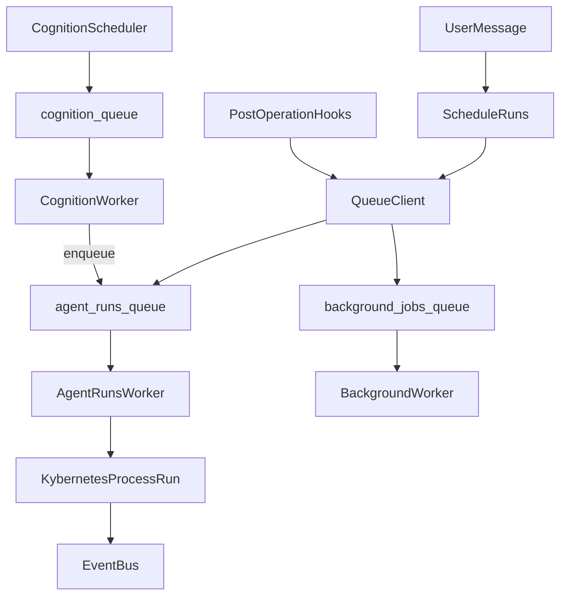
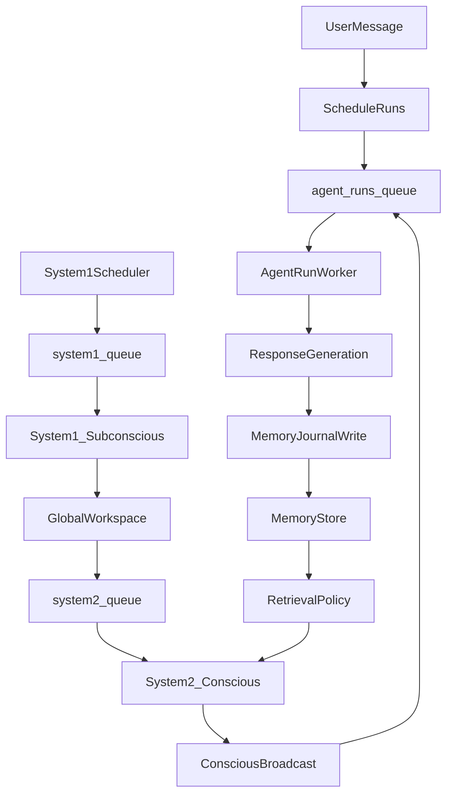
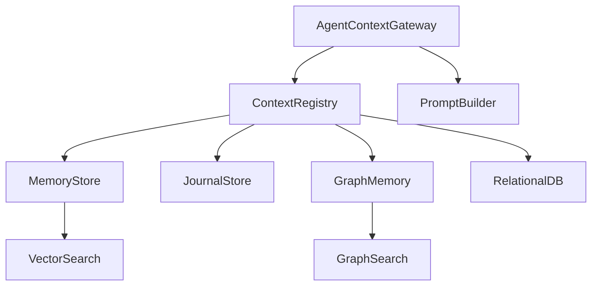

# Agent Brain Deep Dive and Queue-First Refactor Plan

## Goal

Deliver a scalable, queue-first "agent brain" that fixes conversational correctness (no late or duplicate runs), enables System1/System2 cognition with reliable context injection, and provides observable, testable behavior across multiple agents and modes.

## Success Definition

- No duplicate or stale agent responses in multi-agent chats (dedupe + staleness policy enforced)
- Cognition ticks are queue-driven (no timer loops in multi-replica paths)
- Agents consistently use memory/journal/relationship context in prompts
- New modes (RoundRobin, ModeratedPanel, RedTeamReview) are enforced end-to-end
- Admin visibility for queues, cognition, memory, and audit logs is live
- Meets Performance Targets section p95 SLOs for queue wait, context retrieval, cognition tick, orchestration overhead
- Tests cover core guarantees (staleness, dedupe, mode policy, context selection)

## Objectives and Scope

- Fix conversational correctness first: scheduling, staleness, realtime vs polling clarity
- Simulate conscious and subconscious cognition with scalable per-agent heartbeats
- Support role-based, turn-based, and dynamic conversation types
- Modularize cognition into testable units and clear boundaries
- Integrate agent uniqueness data: memory, relationships, journals, needs, beliefs
- Pressure-test code quality and remove false-completion paths

## Deep Dive Findings (evidence)

- Cognitive impulses create runs but bypass the queue by calling `processRun` inline

```5680:5693:lib/features/orchestration/kybernetes.ts
      const run = await prisma.agent_runs.create({
        data: {
          chat_id: channelId,
          agent_id: agentId,
          trigger_message_id: syntheticMessage.id,
          status: "queued",
          priority: "low", // Cognitive runs are lower priority than user-triggered
          reasoning: `Cognitive impulse: ${impulseType} - ${impulseContent.slice(0, 200)}`,
        },
      });

      // Process the run
      await this.processRun(run.id);
```

- Cognitive heartbeats are timer-driven instead of distributed schedulers

```287:299:lib/features/cognition/cognitive-loop.service.ts
  private scheduleNextTick(): void {
    if (!this.isRunning) return;

    const jitter = Math.random() * this.config.tickJitterMs;
    const nextTickMs = this.config.tickIntervalMs + jitter;

    this.loopInterval = setTimeout(async () => {
      await this.runTick();
      this.scheduleNextTick();
    }, nextTickMs);
  }
```

- Background jobs are timer-driven in-process

```315:320:lib/features/jobs/background-jobs.service.ts
  start(): void {
    if (this.processingInterval) return;

    this.processingInterval = setInterval(() => {
      this.processNextJob();
    }, 100); // Check every 100ms
```

- Advanced conversation modes exist but orchestration only handles focus, convo, deliberation

```13:27:lib/features/modes/types.ts
export const CONVERSATION_MODE = {
  // Existing modes
  FOCUS: "focus", // Agents focus on user
  CONVO: "convo", // Free conversation
  DELIBERATION: "deliberation", // Structured decision-making

  // Advanced modes
  BRAINSTORM: "brainstorm", // Rapid idea generation
  DEBATE: "debate", // Structured argumentation
  INTERVIEW: "interview", // Q&A format
  ROLEPLAY: "roleplay", // Character-based interaction
  TEACHING: "teaching", // Socratic instruction
  RESEARCH: "research", // Systematic exploration
  WORKSHOP: "workshop", // Collaborative problem-solving
  COACHING: "coaching", // Goal-oriented guidance
} as const;
```

```573:595:lib/features/orchestration/kybernetes.ts
export function getConversationConfigForChat(chat: chats): AgentConversationConfig {
  const mode = chat.conversation_mode || "focus";

  if (mode === CHAT_MODE.DELIBERATION) {
    return { ...DEFAULT_AGENT_CONVERSATION_CONFIG, enabled: false };
  }

  if (mode === CHAT_MODE.CONVERSATION) {
    return { ...DEFAULT_AGENT_CONVERSATION_CONFIG };
  }

  return { ...DEFAULT_AGENT_CONVERSATION_CONFIG, enabled: false };
}
```

- System 2 deliberation is a placeholder, not an LLM-backed process

```122:139:lib/features/cognition/conscious-processor.ts
/**
 * Perform deliberation (placeholder - would use LLM in production)
 */
async function performDeliberation(
  context: AgentContext,
  thought: ThoughtProposal,
  agent: { provider: string; model: string; temperature: number }
): Promise<DeliberationResult> {
  // Simple rule-based deliberation
  // In production, this would call the LLM provider

  const shouldExpress = thought.salience > 50; // Threshold for expression

  return {
    shouldExpress,
    content: shouldExpress ? thought.content : undefined,
    // No belief/identity updates for now (would require LLM)
  };
}
```

- LLM response caching is stubbed

```75:94:lib/features/orchestration/_lib/llm-executor.ts
/**
 * Get cached response if available
 */
async function getCachedResponse(_cacheKey: string): Promise<CachedResponse | null> {
  // Cache implementation would go here
  // For now, return null (no cache hit)
  return null
}

/**
 * Cache a response
 */
async function cacheResponse(
  _cacheKey: string,
  _response: string,
  _reasoning: string | null | undefined,
  _ttlMs: number,
): Promise<void> {
  // Cache implementation would go here
}
```

- Queue layer BullMQ integration is stubbed, indicating duplicate queue stacks

```37:43:lib/server/queues/task-queue-manager.ts
    if (queueOptions.persistence === "redis") {
      // Use BullMQ via QueueClient
      // Note: This is a simplified integration - full BullMQ integration would require
      // more setup with workers, etc.
      throw new Error(
        'Redis/BullMQ integration not yet implemented. Use persistence: "memory" for now.'
      );
    }
```

## Gaps vs Your Goals

- Conversational issues: no explicit stale-run policy, multiple polling paths, advanced modes not enforced
- Brain simulation: System 2, theory-of-mind, reflection, predictive processing are placeholders
- Scale and heartbeats: timers are not safe for multi-replica and bypass queue observability
- Modularity and testability: cognition modules are tightly coupled to DB and lack unit tests
- Agent uniqueness: context exists in storage but is not consistently injected into prompts

## Target Architecture (Queue-First, Consolidated Layer)

- Consolidate around `[lib/server/queues/*](lib/server/queues/)` as the single BullMQ layer
- Three queues: `agent-runs` (user-facing), `cognition` (ambient), `background-jobs` (hooks)
- BullMQ adoption: QueueEvents, metrics, Job Schedulers, dedupe keys (Option C), flows where multi-step is needed
- Enforce staleness policy in worker preflight to avoid late or irrelevant replies



## BullMQ “all-in” queue topology + workers (concrete)

- **Queue: `agent-runs` (user-facing; highest priority)**
  - **Job name**: `process-agent-run`
  - **Consumers**: one or more `Worker('agent-runs', ...)` processes
  - **Concurrency**:
    - Worker `concurrency` controls per-process parallelism.
    - Optional queue-level **global concurrency** / **global rate limit** caps cluster-wide throughput.
  - **Key invariants (Option C uniqueness)**:
    - **Hard de-dup (Simple mode)**: one active job per `(chatId, agentId, triggerMessageId)`
    - **Anti-stampede de-dup (Throttle mode)**: one active-ish job per `(chatId, agentId)` within a short TTL window
- **Queue: `cognition` (ambient; medium priority)**
  - **Job names**: `cog-tick-agent`, optionally `cog-evaluate-impulse`
  - **Consumers**: dedicated cognition worker process(es) so cognitive work does not starve `agent-runs`.
  - **Scheduling**: use BullMQ **Job Schedulers** (`upsertJobScheduler`) to create per-agent ticking without per-process intervals.
- **Queue: `background-jobs` (maintenance; lowest priority)**
  - **Job names**: `audit-log`, `cache-invalidation`, `event-publish`, `webhook-delivery`, etc.
  - **Consumers**: dedicated background worker process; concurrency can be higher for IO-heavy tasks.

## Worker / process layout (suggested starting point)

- **Process A (API/Realtime)**: Next custom server (`server.ts`) for HTTP + Socket.IO; ideally does not run heavy background loops.
- **Process B (agent runs)**: BullMQ worker(s) consuming `agent-runs`.
- **Process C (cognition + background)**: BullMQ worker(s) consuming `cognition` and `background-jobs` with lower concurrency for cognition.
- Co-location is possible later; queue separation preserves isolation.

## Uniqueness strategy (Option C) — explicit key scheme

- **Hard uniqueness (Simple mode; lasts until job completes/fails)**:
  - `deduplication.id = run:${chatId}:${agentId}:${triggerMessageId}`
- **Anti-stampede uniqueness (Throttle mode; TTL-based)**:
  - `deduplication.id = active:${chatId}:${agentId}` with TTL (~10–30s, tune)
- **Cognition impulse-level uniqueness (optional)**:
  - `deduplication.id = impulse:${agentId}:${channelId}:${impulseType}` with TTL per impulse type
- **Observability**:
  - Listen to BullMQ `deduplicated` events via `QueueEvents` to monitor when/why work is collapsed.

## Concrete improvements (lowest-risk, highest leverage)

- **Cognition -> queue**: change `processCognitiveRun` to enqueue via `IAgentRunQueue` instead of calling `processRun()` inline.
- **Leaderless timers -> schedulers**: replace multi-replica `setInterval`/DB scans with BullMQ Job Schedulers and dedupe keys.
- **Unify polling**: pick one client polling mechanism and disable the others when Socket.IO is available.
- **BackgroundJobsService -> real queue**: introduce an `IJobQueue` abstraction and implement `BullMQJobQueue`.
- **Remove debug ingest fetches**: eliminate hardcoded localhost telemetry calls from production paths.

## Staleness Policy (detailed)

- **Preflight inputs**: `trigger_message_id`, trigger timestamp, latest message id/timestamp, last user message id, last agent message id, run type (user vs cognition), chat mode.
- **Default thresholds (overrideable)**:
  - `STALE_MAX_AGE_MS_USER=10m`
  - `STALE_MAX_AGE_MS_COGNITION=3m`
  - `STALE_MAX_NEW_MESSAGES=8`
  - `STALE_SOFT_THRESHOLD=5`
- **Decision matrix**:
  - **Hard stale**: exceeds age limit or new message count -> mark run `skipped_stale` and drop.
  - **Soft stale**: between soft threshold and hard limit -> refresh context and reduce response scope (short summary or ask for confirmation).
  - **Superseded**: if a newer run exists for the same `(chatId, agentId)` and same or later `trigger_message_id`, drop older run.
- **Observability**:
  - Log `staleness_reason`, `message_gap`, `age_ms`, `run_type`, `mode`.
  - Metrics: `queue.stale_drop.count`, `queue.stale_soft.count`.
- **Audit**: optional audit record for dropped/soft-stale runs (respect audit enablement flags).

## Notes / constraints

- The plan is safe for both single-process and multi-replica deployments.

## Conversation Modes Research and Expansion

- Existing modes defined: focus, convo, deliberation, brainstorm, debate, interview, roleplay, teaching, research, workshop, coaching
- Modes missing for better multi-agent UX and your goals:
  - **RoundRobin**: strict turn order for fairness and clarity
  - **ModeratedPanel**: moderator agent controls turn-taking and enforces rules
  - **RedTeamReview**: one or more agents attack assumptions before synthesis
  - **PairProgramming**: driver and navigator roles with structured handoffs
  - **IncidentTriage**: fact gathering then action plan, with role specialization
  - **ConsensusDelphi**: multi-round anonymous critique then synthesis
  - **SocraticTutor**: question-first teaching mode for stepwise reasoning
- Implementation pattern: define a `ModePolicy` with turn policy, role policy, and response policy, then enforce it in orchestration and prompts

## Dynamic ConversationMode Detection (Auto mode)

- Add a new `Auto` mode (or explicit `mode_source=auto`) so auto-switching only runs when the chat is set to Auto
- Windowed evaluation: re-evaluate every N messages or every T minutes, not per message
- Use agent variables and chat signals: current goal, cadence, roles present, sentiment, direct instructions
- Optional LLM classifier: use a structured prompt for mode selection with confidence and short rationale
- Switch rules: only switch when confidence exceeds threshold and cooldown has elapsed
- Audit trail: store last decision, confidence, and reason in chat metadata

## Agent Uniqueness Data Pipeline

- Promote `[lib/features/cognition/agent-context-loader.ts](lib/features/cognition/agent-context-loader.ts)` as the single source of truth for personality, relationships, needs, journals, memories, beliefs
- Ensure prompt builder uses that context for system prompts and reasoning (no silent omissions)
- Add schema validation at the context boundary so missing fields fail fast

## Config Objects and Overrides

- Add typed config objects for: mode policy, mode detection, queues, cognition, and observability
- Layering precedence: defaults -> global -> chat -> agent -> runtime
- Resolve config with a single `resolveConfig()` helper and Zod validation
- Store effective config + source for debugging (debug-level logging only)

## Logging and Debuggability

- Structured logs for: mode decisions, staleness checks, queue dedupe/retry/fail, cognition ticks, impulse selection
- Include common keys: `chatId`, `agentId`, `runId`, `mode`, `requestId`
- Adopt BullMQ QueueEvents for centralized job lifecycle logging and alerts
- Add audit log tables for agent thinking and background actions (configurable)
- Support audit retention window (days) and per-category enable/disable

## Metrics and Observability Matrix

- Queue metrics: enqueue rate, queue depth, wait time, processing time, retries, dedupe count, stale drops, failed/stalled counts, global concurrency usage
- Cognition metrics: System1 tick rate, System2 deliberation rate, thought proposals per tick, salience distribution, impulse drop reasons
- Memory metrics: retrieval latency, hit/miss rate, embedding cache hit rate, compaction ratio, memory size by type, cross-channel retrieval usage
- Journal metrics: entries per run, reflection completion rate, summary injection length, policy updates derived from reflections
- Conversation metrics: mode switches, mode confidence, turn-taking violations, agent-to-agent responses per chat
- Security metrics: PII redaction counts, admin maintenance actions, retention/compaction jobs executed

### Metric Naming Map (example)

- `queue.enqueued.count` tags: `queue`, `job_type`
- `queue.depth.count` tags: `queue`
- `queue.wait_ms.p95` tags: `queue`
- `queue.retry.count` tags: `queue`, `job_type`, `reason`
- `queue.dedupe.count` tags: `queue`, `dedupe_key`
- `queue.stale_drop.count` tags: `queue`, `reason`
- `cognition.system1.tick.count` tags: `agent_id`
- `cognition.system2.deliberation.count` tags: `agent_id`, `mode`
- `cognition.salience.avg` tags: `agent_id`, `module`
- `memory.retrieval.ms.p95` tags: `agent_id`, `memory_type`
- `memory.hit_rate` tags: `agent_id`, `memory_type`
- `memory.embedding.cache_hit_rate` tags: `agent_id`
- `journal.entry.count` tags: `agent_id`, `entry_type`
- `journal.summary.tokens` tags: `agent_id`
- `mode.switch.count` tags: `chat_id`, `from`, `to`
- `run.metadata.write.count` tags: `agent_id`, `provider`, `model`
- `audit.event.count` tags: `category`, `level`

### Audit Logging (agent thinking)

- Audit tables for: `agent_thoughts`, `agent_actions`, `agent_reflections`, `agent_memory_events`
- Each audit record includes: `agent_id`, `chat_id`, `run_id`, `category`, `payload`, `created_at`
- Config flags:
  - `AUDIT_LOGGING_ENABLED` (global)
  - `AUDIT_LOGGING_LEVEL` (minimal|standard|verbose)
  - `AUDIT_RETENTION_DAYS`
  - Per-category overrides (e.g. `AUDIT_THOUGHTS_ENABLED`)

## Scenario Test Harness

- Add a scenario runner that reads JSON/YAML test fixtures
- Each scenario defines: steps, expected mode outcomes, queue behavior, staleness behavior
- Run against mock LLM provider for determinism
- Capture a trace timeline (events + decisions) for debugging failures

## Code Quality and False-Completion Highlights

- HIGH: debug ingest fetch calls in `[lib/features/orchestration/kybernetes.ts](lib/features/orchestration/kybernetes.ts)` should be gated or removed
- HIGH: queue layer stub in `[lib/server/queues/task-queue-manager.ts](lib/server/queues/task-queue-manager.ts)` indicates incomplete integration
- HIGH: cache stub in `[lib/features/orchestration/_lib/llm-executor.ts](lib/features/orchestration/_lib/llm-executor.ts)` implies performance features do not exist
- MED: System 2 deliberation placeholder in `[lib/features/cognition/conscious-processor.ts](lib/features/cognition/conscious-processor.ts)`
- MED: interest monitoring uses simulated search and TODOs in `[lib/features/cognition/interest-monitor.ts](lib/features/cognition/interest-monitor.ts)`

## Memory, Journal, and Metadata Enhancements

- Memory retrieval risks: embedding regeneration, Redis scan, JSON file search, parallel query saturation
- Journal usage gaps: truncated entries, structured metadata not injected, many runs lack journals
- Metadata gaps: `agent_runs` lacks JSON metadata for model, tokens, latency, tool usage
- Uniqueness gaps: cognition context loaded but not injected (needs, predictions, mental models, emergent identity)

### Improvements

- Add embedding cache + batch embedding generation
- Optionally introduce pgvector later; for now optimize in-app search
- Partition `agent_memories` and `agent_journals` by `created_at` (keep all, partitioned)
- Add missing composite indexes for common queries
- Add `metadata` JSONB to `agent_runs` and populate run details
- Inject structured journal metadata and cognition context into prompts
- Add journal summarization for prompt usage without deleting originals

## Agent Run Metadata (feedback loop)

- Add `agent_runs.metadata` JSONB for model, tokens, latency, tool usage, prompt context version
- Store queue/job IDs, staleness score, dedupe keys, and memory/journal references
- Use run metadata in reflection generation and memory updates
- Make run metadata visible in admin endpoints and diagnostics

## Journal System (full storage, summary injection)

- Store full journal entries (no truncation in storage)
- Inject structured summaries only (observations/learnings/actionItems) to control tokens
- Add journal summarization that produces “policy-like” reflections
- Journals influence personality drift; memories capture durable facts/preferences

## Context Gateway / Registry (DRY retrieval)

- Introduce `AgentContextGateway` as the central entry point for reads/writes
- Add `ContextRegistry` defining context types, retrieval rules, scoring, and injection
- Cache and reuse common context queries to reduce duplicate Prisma calls
- Support per-mode retrieval budgets and relevance thresholds

## Patterns and Model Map

- Standardize naming for memory types, journal types, cognitive events, queue job names
- Define workflow stages: System1 -> Workspace -> System2 -> Broadcast -> Action
- Add context schema versioning to support forward compatibility

## Security and Typed Config Overrides

- Add a security policy for memory/journal data: PII scrubbing, retention, audit trails
- Require admin auth for memory/journal CRUD and maintenance endpoints
- Define typed config objects with Zod validation
- Override precedence: defaults -> env -> global -> chat -> agent -> runtime
- Support env overrides like `COGNITION_TICK_MS`, `MEMORY_RETENTION_DAYS`, `QUEUE_GLOBAL_LIMIT`

## Agent Admin Endpoints (detail + maintenance)

- Add admin endpoints to fetch agent details (persona, memory stats, journal stats, cognition state)
- Add CRUD endpoints for agent memory and journal entries
- Add maintenance endpoints:
  - `POST /api/admin/agents/[id]/memory/compact` to force memory compression/summarization
  - `POST /api/admin/agents/[id]/memory/flush` to clear or archive selected memory types
  - `POST /api/admin/agents/[id]/journals/compact` to summarize older journals

### Draft endpoint list (admin-only)

#### Agent details and stats

- `GET /api/admin/agents/[id]`
  - Returns: agent profile, persona, cognitive config, memory/journal counts, last activity, model/provider
- `GET /api/admin/agents/[id]/stats`
  - Returns: memory counts by type, journal counts by type, recent run metrics, compression stats

#### Memory CRUD

- `GET /api/admin/agents/[id]/memory`
  - Query: `type`, `channel_id`, `limit`, `cursor`, `min_similarity`
  - Returns: memory entries + metadata
- `POST /api/admin/agents/[id]/memory`
  - Body: `{ key, value, memory_type, channel_id?, metadata?, expires_at? }`
- `DELETE /api/admin/agents/[id]/memory/[key]`
  - Query: `type` (memory_type)

#### Journal CRUD

- `GET /api/admin/agents/[id]/journals`
  - Query: `entry_type`, `limit`, `cursor`
- `POST /api/admin/agents/[id]/journals`
  - Body: `{ entry, entry_type, metadata? }`
- `DELETE /api/admin/agents/[id]/journals/[journalId]`

#### Maintenance

- `POST /api/admin/agents/[id]/memory/compact`
  - Body: `{ strategy: "summarize"|"compress", window?: "last_30d"|string }`
- `POST /api/admin/agents/[id]/memory/flush`
  - Body: `{ types?: string[], channel_id?: string, archive?: boolean }`
- `POST /api/admin/agents/[id]/journals/compact`
  - Body: `{ window?: "last_90d"|string, archive?: boolean }`

## Admin UI Updates (visibility)

- Queue dashboard: queue depth, wait time, retries, failures, dedupe counts
- Cognition dashboard: tick rates, impulse types, salience trends, reflection rates
- Memory dashboard: memory counts by type, retrieval latency, compaction stats
- Agent detail panel: persona drift, recent journals, memory highlights, last run metadata
- Maintenance actions: compact/flush memory and journals with audit trail

### Admin UI Expansion (new pages/data)

- New Agent Insights page:
  - Current cognitive state snapshot (needs, predictions, emotional state)
  - Last N thoughts with salience and module source
  - Reflection summaries and policy updates derived
  - Recent memory usage with retrieval scores
- New Agent Jobs page:
  - Scheduled jobs, last run, next run
  - Job history with status, latency, and output summary
- New Memory Explorer:
  - Filter by memory type, channel, relevance
  - Cross-channel memory visibility
- New Audit Log Viewer:
  - Filter by category, agent, time window
  - Drill down into thought/action/reflection events

### Admin UI Mapping to Existing Pages

- `app/admin/insights`: add queues/cognition tabs, staleness KPIs, mode switch analytics
- `app/admin/memory`: add graph memory stats, compaction history, retrieval latency
- `app/admin/costs`: add token budget usage, bucketed token logging, provider costs by mode
- New routes where needed: `/admin/queues`, `/admin/cognition`, `/admin/audit-logs`, `/admin/tools`, `/admin/runs`

## Performance and Cache Strategy

- Define performance budgets (p50/p95 for agent runs, memory retrieval, cognition ticks)
- Add cache strategy per layer:
  - Memory retrieval cache (per-agent, per-type)
  - Prompt context cache with TTL and invalidation on new messages
  - Embedding cache and batch generation
- Log cache hits/misses per agent and per layer
- Expose cache metrics in admin dashboards

## Code Quality and Strong Typing Rules

- No magic numbers or strings: define constants/enums/types in shared constants
- Prefer `const` objects with `as const` for enums
- No `any` types; enforce strict typing and Zod validation at boundaries
- Use shared config helpers from `lib/server/env/env.utils.ts`
- Use structured logger from `lib/server/logging/logger.utils.ts`

## Code Style Checklist and Config Override Patterns

### Code Style Checklist

- All cross-cutting values in constants (timeouts, limits, thresholds)
- No inline strings for event names or modes; use enums/const maps
- Prefer small pure functions with typed inputs/outputs
- Avoid duplicate Prisma queries; use centralized context gateway

### Config Override Patterns (defaults + env + test)

- Defaults defined in code: `getDefaultConfigX()`
- Env override via `Env.getNumber/getBoolean/getString` (each supports default values) and Zod validation
- Test overrides pass explicit config object to constructor or factory
- Example precedence: defaults -> env -> global -> chat -> agent -> runtime

## Agent Loop Visibility

- Provide a unified “agent loop trace”:
  - queue job -> cognition tick -> thought selection -> run -> memory/journal write
- Surface loop trace in admin UI and audit logs
- Include timing and causal links between steps

## Testing Requirements

- Unit tests: context gateway, thought lifecycle, mode resolver, cache policies
- Integration tests: queue schedulers, cognition pipeline, memory retrieval
- E2E tests: admin dashboards, agent scheduled jobs, cross-channel memory usage
- Scenario tests: behavioral guarantees (before/after) with deterministic fixtures

## Tools Audit and Self-Sufficiency

### Current tool inventory (from `lib/features/tools/*`)

- Memory/Journals: `remember_fact`, `recall_fact`, `add_journal_entry`, `get_my_journal`
- Context: `chat_context`, `get_user_context`, `get_agent_profiles`
- Social: `direct_message`, `send_private_message`, `check_private_messages`, `get_relationship_status`
- Web/Info: `web_search`, `read_webpage`, `search_news`, `search_reddit`, `search_arxiv`, `search_hackernews`
- Utility: `tool_belt`, `calculator`, `get_datetime`, `unit_converter`, `file_generation`, `code_execution`
- Polls: `poll` + `poll_scheduler`

### Gaps to enable autonomous agents

- **Scheduler tool**: create/update/cancel agent jobs with `run_at` and recurrence
- **Reflection tool**: trigger reflection with structured metadata input and output
- **Memory curator tool**: summarize, merge, compress, and tag memories
- **Graph extraction tool**: extract entities/relations into graph memory
- **Audit tool**: emit structured audit events for background thinking

### Tool governance

- Add per-tool permissions, rate limits, and safety gates
- Add tool metrics: usage rate, latency, error rate, and outcome quality
- Tool logging uses `lib/server/logging/logger.utils.ts`

## Open Items (remaining)

- Validate staleness thresholds per mode and run type with real traffic
- Define canary percentages and rollback triggers per feature flag
- Confirm admin UI reuse vs new pages for `/admin/queues` and `/admin/cognition`
- Decide whether to fold P0 memory-leak remediation into Phase 0 or keep separate
- Confirm `sqlite-vec` availability in target deployments and fallback behavior acceptance

## Expand Next (recommended)

- Persona authority: source of truth (`agent_personas` vs `adaptive_personalities`)
- System1/System2 scheduling: exact intervals per persona and cooldown overlaps
- Thought lifecycle math: reinforcement/decay formulas and thresholds
- Admin UI routes: list actual route names + minimal v1 per dashboard

## Numeric Budgets (initial defaults, configurable)

- System1 tick interval: 2–5 minutes per agent
- System2 tick interval: 10–20 minutes per agent
- Cooldown after action: 10 minutes
- Max actions per agent per hour: 3–5
- Context token budgets (initial):
  - persona/system: 1200
  - memory facts/preferences: 800
  - journals (summary only): 400
  - relationships/social: 400
  - epistemic/beliefs: 300
  - recent messages: 1200
  - total target: 3500–4500
- Budget enforcement is **off by default**; enable via config/env
- All budget values must be overrideable via config objects or `.env`
- Log token usage per run and per context bucket (persona/memory/journals/etc.)
- Token logging should use `lib/server/logging/logger.utils.ts` and emit metric events with agent tags for reporting/charting

### Env Overrides (aliases supported)

All three prefixes are aliases for the same value. Precedence:
`AGENT_CONTEXT_BUDGET_*` > `CONTEXT_BUDGET_*` > `BUDGET_*`.

- `BUDGETS_ENABLED=false` (default)
- `BUDGET_PERSONA_TOKENS=1200`
- `BUDGET_MEMORY_TOKENS=800`
- `BUDGET_JOURNAL_TOKENS=400`
- `BUDGET_RELATIONSHIP_TOKENS=400`
- `BUDGET_EPISTEMIC_TOKENS=300`
- `BUDGET_RECENT_MESSAGES_TOKENS=1200`
- `BUDGET_TOTAL_TOKENS=4500`

Aliases (same meaning):

- `CONTEXT_BUDGET_*`
- `AGENT_CONTEXT_BUDGET_*`

### Token Logging Flags

- `TOKEN_LOGGING_ENABLED=false` (default)
- `TOKEN_LOGGING_SAMPLE_RATE=1.0`
- `TOKEN_LOGGING_BUCKETS=persona,memory,journals,relationships,epistemic,history,total`

### .env.local (plan snippet)

```bash
# Budget enforcement (off by default)
BUDGETS_ENABLED=false

# Token budgets
BUDGET_PERSONA_TOKENS=1200
BUDGET_MEMORY_TOKENS=800
BUDGET_JOURNAL_TOKENS=400
BUDGET_RELATIONSHIP_TOKENS=400
BUDGET_EPISTEMIC_TOKENS=300
BUDGET_RECENT_MESSAGES_TOKENS=1200
BUDGET_TOTAL_TOKENS=4500

# Token logging
TOKEN_LOGGING_ENABLED=false
TOKEN_LOGGING_SAMPLE_RATE=1.0
TOKEN_LOGGING_BUCKETS=persona,memory,journals,relationships,epistemic,history,total
```

## Context Selection Algorithm (scored + budgeted)

- Score memory items:
  - 0.4 semantic similarity
  - 0.2 recency
  - 0.2 importance
  - 0.2 relationship relevance
- Rank per type, select until budget is reached
- Prefer structured summaries over raw text
- Inject graph memory only for relational queries
- Emit context manifest into `agent_runs.metadata`

## Migration Strategy (metadata + partitioning + gateway)

- Add `agent_runs.metadata` JSONB with default `{}` and backfill last N runs
- Partition `agent_memories` and `agent_journals` by `created_at` (monthly)
- Adjust unique constraints to include partition key
- Introduce `AgentContextGateway` behind feature flag, run side-by-side, then flip default

## Vector/Graph/Retention Decisions

- Vector backend (database-agnostic design):
  - Introduce `IVectorStore` interface and select backend via config/env
  - SQLite: implement `SqliteVectorStore` using sqlite-vec/sqlite-vector extension
  - Postgres: implement `PostgresVectorStore` using pgvector (later phase)
  - Default: sqlite-vec when SQLite (fallback to in-app cosine + embedding cache if unavailable)
  - Verify current DB provider (SQLite vs Postgres) and load the right adapter
- Graph memory:
  - Start with relational adjacency tables for entities/relations (DB-agnostic)
  - Add graph retrieval policy for relational queries only
  - Introduce `IGraphStore` interface for future graph DB swap
- Retention:
  - Keep-all with partitioning as default
  - Optional archival tier later if storage growth demands

## Decisions & Defaults (Locked)

- **Vector backend**: default `sqlite-vec` for SQLite; fallback to in-app cosine; use `pgvector` for Postgres. Defaults: `VECTOR_ENABLED=true`, `VECTOR_BACKEND=sqlite-vec`, `VECTOR_FALLBACK=cosine`.
- **Graph storage**: relational adjacency tables with `RelationalGraphStore` as the default implementation. Extraction runs via background job (default interval: 30 minutes, overrideable).
- **Audit logging policy**: separate from metrics; disabled by default with a default retention of 30 days. Defaults: `AUDIT_LOGGING_ENABLED=false`, `AUDIT_RETENTION_DAYS=30`. Override per env, per mode, per agent.
- **Budget enforcement**: disabled by default. Enable per env, per mode, per agent (CSV allowlist). Defaults: `BUDGETS_ENABLED=false`, `BUDGETS_AGENT_ALLOWLIST=""`.
- **Tool permissions**: default tools share the same baseline permissions; elevated/restricted access is defined per tool and per agent.
- **Persona authority**: `agent_personas` is the source of truth; `adaptive_personalities` is derived and must never override the base persona.

## Expanded Missing / Under-Expanded Areas

### Migration Details (dual-write, backfill, cutover)

- **Phase 1: Schema + adapters**: add new fields/tables (e.g., `agent_runs.metadata` expansion, partitioned tables), implement repository adapters that can write old + new.
- **Phase 2: Dual-write**: enable write to both schemas; add mismatch metrics and logs.
- **Phase 3: Backfill**: batch backfill older rows with checkpointed jobs and idempotent upserts.
- **Phase 4: Cutover**: flip read path via feature flag; monitor regressions.
- **Phase 5: Cleanup**: remove legacy reads, then legacy writes after stability window.

### Context Selection Rules (tie-breakers, fallback, per-mode overrides)

- **Primary score**: weighted salience + recency + relevance + agent affinity.
- **Tie-breakers**: prefer same-chat over cross-chat, newer over older, verified over unverified, then stable sort by `source_id`.
- **Fallbacks**: if no high-confidence context, inject the last 3 messages + agent summary only.
- **Per-mode overrides**:
  - `deliberation`: weight factual memories higher.
  - `brainstorm`: weight novelty and diversity higher.
  - `focus`: weight user messages and recent summaries highest.

### Cache Invalidation (explicit triggers + TTLs)

- **Triggers**:
  - New message -> invalidate chat context cache.
  - Memory write/update -> invalidate agent memory cache.
  - Journal write -> invalidate reflection cache.
  - Persona update -> invalidate prompt cache.
- **Default TTLs**:
  - Chat context: 30s
  - Memory slice: 5m
  - Persona prompt: 5m
  - Graph adjacency: 10m

### Idempotency and Dedupe Keys (per job)

- **Agent runs**: `run:${chatId}:${agentId}:${triggerMessageId}`
- **Cognition ticks**: `cog:${chatId}:${agentId}:${tickId}`
- **Reflections**: `reflect:${agentId}:${windowStart}`
- **Compaction**: `compact:${agentId}:${partitionId}`
- **Memory indexing**: `embed:${agentId}:${memoryId}`
- **Scheduled reminders**: `schedule:${agentId}:${jobType}:${dedupeKey}`

### Graph Memory Schema + Extraction

- **Tables**:
  - `graph_entities(id, agent_id, type, label, metadata, created_at)`
  - `graph_edges(id, agent_id, from_entity_id, to_entity_id, relation_type, weight, created_at)`
  - `graph_sources(id, entity_id, message_id, confidence, created_at)`
- **Indexes**: `(agent_id, type)`, `(agent_id, relation_type)`, `(from_entity_id)`, `(to_entity_id)`
- **Extraction**: run as background jobs; default interval 30 minutes; write source attribution and confidence.

### Audit Log Schema + Indexing

- **Fields**: `id`, `agent_id`, `chat_id`, `run_id`, `event_type`, `payload_json`, `created_at`
- **Indexes**: `(agent_id, created_at)`, `(chat_id, created_at)`, `(event_type, created_at)`

### Feature Flags / Rollout

- `CONTEXT_GATEWAY_ENABLED`
- `GRAPH_MEMORY_ENABLED`
- `VECTOR_STORE_ENABLED`
- `BUDGETS_ENABLED`
- `BULLMQ_ENABLED`
- `COGNITION_QUEUE_ENABLED`

### Rollout and Rollback Plan

- **Stage 0 (off by default)**: all new subsystems behind flags; no behavior change.
- **Stage 1 (dev/staging)**: enable one flag at a time; capture baseline metrics.
- **Stage 2 (canary)**: enable per agent/chat allowlist; compare SLO deltas and error rates.
- **Stage 3 (broad)**: expand to full environment once SLOs and stability hold.
- **Rollback**: disable flag immediately if p95 latency regresses >20%, stale drop rate spikes, or error rate doubles.
- **Kill switches**: each subsystem has a dedicated flag to revert to previous behavior.

### Performance Targets (initial SLOs)

- Queue wait p95 < 2s
- Context retrieval p95 < 150ms
- Cognitive tick overhead p95 < 200ms
- LLM orchestration overhead p95 < 400ms

### Test Coverage Mapping (guarantee -> test type)

- **No duplicate runs** -> queue integration test
- **Late jobs dropped** -> unit tests on staleness policy
- **Context selection stable** -> deterministic snapshot tests
- **Memory retrieval correctness** -> integration tests with mock DB
- **Graph + vector retrieval** -> contract tests with fake stores
- **End-to-end conversation flow** -> Playwright scenario tests

### Tool Policies and Safety Defaults

- Each tool declares **scope**, **side effects**, **rate limit**, and **required provenance**.
- Default policy is least-privilege with explicit allowlist per agent.
- Tool calls must emit structured logs + metrics for auditability.

### System1 / System2 Scheduling Defaults

- **System1 (subconscious)**: tick every 2–5 minutes with jitter; short cooldown (2–5m).
- **System2 (conscious)**: tick every 10–20 minutes; cooldown 10m; never run concurrently with active System1 run for same agent.
- All values overrideable per agent and per mode.

### Thought Lifecycle Math (reinforcement + decay)

- **Base score**: `score = score * decay + reinforcement`.
- **Decay**: default 0.90 per tick.
- **Reinforcement**: +5 for user mention, +2 for related context hit, +1 for time-based recurrence.
- **Expression threshold**: default >= 50 to become a surfaced thought.

### Admin UI Routes (minimal v1)

- `/admin/queues`: queue health, dedupe stats, retries
- `/admin/cognition`: per-agent tick status, impulses, run backlog
- `/admin/memory`: memory counts, storage type, compaction status
- `/admin/audit-logs`: audit events with retention controls
- `/admin/tools`: tool inventory, policies, per-agent permissions
- `/admin/runs`: run lifecycle, latency, failure reasons

### Tool Autonomy MVP (agent parity)

- **Required tools**: `search`, `recall`, `remember`, `forget`, `schedule`, `summarize`, `fetch_chat_context`, `fetch_agent_context`.
- **Updates needed**: consistent schemas, scoped permissions, structured logging, and rate limits per tool.

## Behavioral Guarantees (before/after scenarios)

- Cross-channel memory: reliable retrieval and injection with relevance scoring
- Divergence over time: personality drift based on journals, memories, and relationships
- Conscious/subconscious metadata: unified audit trail for “why did the agent act?”
- Agent-scheduled jobs: autonomous reminders and follow-up actions via schedulers
- Reflections: become structured policy updates, not just text logs

## ROI and Quantification (what we measure)

- Response latency: p50/p95 for agent runs before/after queue consolidation
- Memory hit rate: % of responses using retrieved memory items
- Divergence score: cosine distance between agent preference vectors over time
- Reflection impact: behavior changes traced to reflection-derived policies
- Stability: reduced duplicate runs and stale replies (dedupe + staleness policy)

## Milestones and Parallel Workstreams

### Milestone 0: Behavioral Correctness

- Staleness policy, dedupe invariants, late-run handling
- Structured logging for decisions and run metadata

### Milestone 1: Queue-First Brain

- Consolidate queues, enable QueueEvents and metrics
- Replace timers with Job Schedulers for System1/2

### Milestone 2: Conscious/Subconscious Pipeline

- Explicit System1/System2 contracts
- Global workspace broadcast stage
- Recurring/emergent thought lifecycle

### Milestone 3: Memory/Journals/Context

- Context gateway and registry
- Full journals with summary injection
- Run metadata feedback loop

### Milestone 4: Modes and Real Interactions

- Mode policies, turn-taking, group dynamics
- Auto mode detection with confidence thresholds

### Milestone 5: Quality, Security, Tests

- Security hardening, PII policy, admin endpoints
- Scenario harness and regression tests

### Parallel Workstreams (multi-agent execution)

- Workstream_A QueueAndOrchestration: queues, schedulers, dedupe, metrics
- Workstream_B CognitionPipeline: System1/2, workspace broadcast, thought lifecycle
- Workstream_C MemoryAndJournals: context gateway, embeddings cache, journaling
- Workstream_D ModesAndUX: mode policy, turn-taking, auto detection
- Workstream_E ObservabilitySecurity: logging, PII, admin endpoints, test harness

## Diagrams: Conscious/Subconscious Flow



## Diagrams: Context and Memory Retrieval



## Phased Execution Plan (communication first)

- Deep dive review of current plan, architecture docs, and queue usage
- Repo scan for timers, queue bypasses, conversation mode mismatches, stubs
- Phase 0: Communication correctness
  - Add staleness policy for late runs in worker preflight
  - Add dedupe keys for Option C at enqueue time
  - Unify realtime vs polling behavior and visibility in UI
- Phase 1: Queue layer consolidation
  - Refactor orchestration to use QueueClient and WorkerManager
  - Add QueueEvents, metrics, and global rate limits where needed
  - Migrate BackgroundJobsService to BullMQ
- Phase 2: Cognition heartbeats and brain simulation
  - Replace timer loops with BullMQ Job Schedulers per agent
  - Enqueue cognition actions to `agent-runs` queue, remove inline `processRun`
  - Implement LLM-backed System 2 deliberation, reflection, and theory-of-mind hooks
- Phase 3: Conversation modes expansion
  - Implement ModePolicy framework and enforce in orchestration
  - Ship first new modes: RoundRobin, ModeratedPanel, RedTeamReview
  - Add prompts and UI controls for role-based and turn-based flows
  - Implement Auto mode detection with windowed evaluation and confidence thresholds
- Phase 4: Quality hardening and test coverage
  - Remove debug ingest calls and stubbed cache or implement real caching
  - Add unit and integration tests for queue scheduling, cognition, and modes
  - Add scenario-driven tests for Auto mode detection and staleness policy
  - Add tests for memory compaction and admin maintenance endpoints

## Key Files to Touch

- `[lib/server/queues/queue-client.ts](lib/server/queues/queue-client.ts)`
- `[lib/server/queues/task-queue-manager.ts](lib/server/queues/task-queue-manager.ts)`
- `[lib/features/orchestration/BullMQAgentRunQueue.ts](lib/features/orchestration/BullMQAgentRunQueue.ts)`
- `[lib/features/orchestration/kybernetes.ts](lib/features/orchestration/kybernetes.ts)`
- `[lib/features/cognition/cognitive-loop.service.ts](lib/features/cognition/cognitive-loop.service.ts)`
- `[lib/features/cognition/agent-cognitive-worker.ts](lib/features/cognition/agent-cognitive-worker.ts)`
- `[lib/features/jobs/background-jobs.service.ts](lib/features/jobs/background-jobs.service.ts)`
- `[lib/features/modes/types.ts](lib/features/modes/types.ts)`
- `[lib/features/modes/mode-resolver.ts](lib/features/modes/mode-resolver.ts)`
- `[lib/features/config/](lib/features/config/)`
- `[lib/features/observability/](lib/features/observability/)`
- `[__tests__/scenarios/](__tests__/scenarios/)`
- `[lib/features/memory/](lib/features/memory/)`
- `[app/api/admin/agents/](app/api/admin/agents/)`
- `[components/chat/chat-settings-dialog.tsx](components/chat/chat-settings-dialog.tsx)`
- `[hooks/page/useMessagePolling.ts](hooks/page/useMessagePolling.ts)`
- `[app/api/chats/[id]/schedule-runs/route.ts](app/api/chats/[id]/schedule-runs/route.ts)`

## Validation and Milestone Checks

- Run `npm run lint && npm run typecheck` per phase
- Add targeted tests for staleness handling, dedupe enforcement, and mode policy
- Milestone reflection after each phase: confirm latency, correctness, and cognitive output quality

## Assumptions

- Queue layer consolidation is the chosen path
- BullMQ is the queue system, Kafka is out of scope
- Communication correctness is the first deliverable before deeper cognition refactors
- Auto mode detection only applies when chat mode is Auto
- Memory/journal data is retained but partitioned for scalability

## Conscious/Subconscious Architecture (explicit guarantees)

- Define System 1 (subconscious) vs System 2 (conscious) as separate schedulers and queues
- System 1: fast, low-cost, high-frequency updates (needs decay, prediction error, affect)
- System 2: slower, LLM-backed deliberation (decision and response formation)
- Add “conscious broadcast” stage: only selected thoughts are promoted to conscious state
- Add anti-loop guarantee: no agent-to-agent auto loops unless enabled by a conversation mode
- Add per-agent heartbeat contracts to prevent shared/global loops

## Thought Lifecycle (recurring vs emergent)

- Add “emergent thoughts” from prediction errors or novelty signals
- Add “recurring thoughts” via reinforcement/decay policy
- Maintain thought queue with TTL, decay, and salience adjustments
- Route thoughts into reflection or action based on mode and confidence

## Inner Role Agents (specialized micro-agents)

- Introduce prompted internal roles for cognition pipeline:
  - Generator, Critic, Planner, Reflector, Memory Curator
- Each role has metadata schema and budget caps
- Invoke roles selectively based on mode and task type

## Graph Memory + Beyond Text Tables

- Add optional graph memory representation for relationships and facts
- Store entities/relations from journals and memories into graph nodes
- Retrieval policy: graph-first for relational queries, vector-first for semantic recall
- Defer full GraphRAG until vector/perf baselines are stable

## External Research Synthesis (to align architecture)

- Global Workspace Theory: supports “conscious broadcast” and module competition
- Predictive processing: prediction-error drives emergent thought generation
- Memory consolidation: summaries represent consolidated memory
- Conversation science: turn-taking and floor control inform mode policies
- Group dynamics: debate vs consensus protocols influence mode selection
- Agent intelligence: reflection and memory frameworks (Reflexion, MemGPT, Generative Agents)
- Graph retrieval: GraphRAG for relational memory
- Thought branching: Tree-of-Thoughts for System 2
