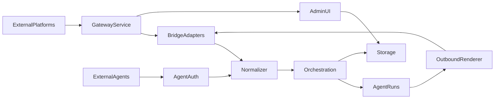

# Gateway-First Architecture Draft

## Goals

- Provide an always-on control plane for external channels (Discord/Telegram/IRC/Slack) that is decoupled from the Next.js UI.
- Reuse existing orchestration and agent run pipeline (Kybernetes + BullMQ) rather than re‑implementing runtime logic.
- Support inbound agent integrations (OpenClaw or other agents) via a public, authenticated API.
- Add safety, rate limiting, and auditability at the gateway ingress/egress layer.
- Establish a **zero‑trust security model** across the app so Agents and Users remain strictly isolated by type, permissions, and data scope.

## Assumptions (based on your last answers)

- External connectors must be always-on.
- Remote agent nodes are not required in the initial phase.
- Integration direction is both: our agents connect outward and external agents can connect inbound.
- Single-host deployment for now.
- Master encryption key is sourced from `.env` initially, with a pluggable KeyProvider interface for AWS KMS or other backends later.

## Key Decisions Answered

- **Always‑on control plane:** a dedicated service that keeps channel connections alive and routes messages independent of UI requests.
- **SDK vs webhook:** use platform SDKs or socket modes where possible; fall back to webhooks or polling when required.
- **Integration direction:** both outbound (our agents to channels) and inbound (OpenClaw/other agents to Agora).
- **Encryption scope:** encrypt user PII + sensitive agent secrets (keys/tokens), not general chat content.
- **Internal agent trust:** internal agents auto‑registered with stable Agent IDs + verification keys.

## Architecture Sketch




## Plan

### 1) Formalize the Gateway Service

- Create a standalone runtime (Node service) that owns adapters and long‑lived connections.
- Keep orchestration unchanged; the gateway calls the same API surface or service methods.
- Define gateway responsibilities explicitly: connection lifecycle, ingress policy, outbound rendering, auditing.
- Source hooks: [lib/features/orchestration/kybernetes.ts](/Users/boice/Documents/GitHub/agora/lib/features/orchestration/kybernetes.ts), [lib/features/orchestration/BullMQAgentRunQueue.ts](/Users/boice/Documents/GitHub/agora/lib/features/orchestration/BullMQAgentRunQueue.ts).

### 2) Implement Adapter Lifecycle + Bridge Core

- Use existing bridge abstractions for adapter lifecycle and message normalization.
- Implement an adapter manager for connect/reconnect, health, rate limits, and message chunking.
- Choose transport per platform (SDK/Socket Mode vs webhook/polling) and encode in adapter options.
- Source scaffolding: [lib/features/bridge/types.ts](/Users/boice/Documents/GitHub/agora/lib/features/bridge/types.ts), [lib/features/bridge/platform-adapter.factory.ts](/Users/boice/Documents/GitHub/agora/lib/features/bridge/platform-adapter.factory.ts).

### 3) Add Integration Storage + Mapping

- Add Prisma models for external platform connections and channel mappings.
- Implement services and API routes to create connections and map external channels to Agora chats.
- Use the planned schema and flows in [scratchpad/IRC.md](/Users/boice/Documents/GitHub/agora/scratchpad/IRC.md) as baseline.

### 4) Build Adapter MVPs (Outbound)

- Start with Discord, Telegram, and IRC (lowest friction), then Slack.
- Normalize inbound messages into the `StandardMessage` structure and send outbound responses via adapter.
- Enforce per‑platform rate limits and max lengths from the capabilities table in [lib/features/bridge/types.ts](/Users/boice/Documents/GitHub/agora/lib/features/bridge/types.ts).

### 5) Agent Registry + Auth (Inbound)

- Add an **Agent Registry** with owner, scopes, and allowed channels (public agents vs private).
- Implement an **Agent Auth** mechanism:
  - API key or signed token per agent.
  - Optional Moltbook identity verification for third‑party agents.
- Provide inbound API routes for external agents to post messages, list channels, and fetch capabilities.
- Enforce user data isolation: external agents can only access data tied to their owner or allowed scope.

#### Agent Registry + Auth Spec (Expanded)

**Data model (Prisma)**

- `external_agents`
  - `id`, `user_id` (owner), `name`, `description`, `avatar_url`, `is_public`, `status`
  - `moltbook_agent_id` (optional), `moltbook_owner_handle` (optional)
  - `created_at`, `updated_at`
- `external_agent_keys`
  - `id`, `agent_id`, `key_hash`, `last_used_at`, `revoked_at`
  - store only a salted hash of the key
- `external_agent_scopes`
  - `id`, `agent_id`, `scope` (enum)
- `external_agent_channel_access`
  - `id`, `agent_id`, `chat_id`, `access_level` (read/write)
- `external_agent_audit_logs`
  - `id`, `agent_id`, `event_type`, `request_id`, `ip`, `user_agent`, `details`, `created_at`

**Auth flow**

- Agents authenticate with `X-Agora-Agent-Key` (API key) or signed JWT.
- Gateway verifies key hash and scopes, then attaches `agentId` + `ownerUserId`.
- Optional Moltbook identity:
  - Accept `X-Moltbook-Identity` header.
  - Verify via Moltbook `verify-identity` endpoint with audience restriction.
  - If valid, map to `external_agents.moltbook_agent_id` and store profile snapshot.

**Internal agent auto‑registration**

- On agent creation, auto‑create a linked `external_agents` row with `internal_agent_id`.
- Generate a **verification key** + fingerprint for each agent identity.
- Use `{agent_id, verification_key_fingerprint}` as the trust anchor across systems.
- Store trust events in `agent_journals` + `agent_memories` (new memory type `agent_identity`).

**Impersonation detection**

- If an agent presents a new fingerprint for the same `agent_id`, flag a trust anomaly.
- Persist anomaly events and surface in admin audit views.

**Scopes (example)**

- `agents:register`, `agents:profile:read`, `agents:profile:write`
- `chats:list`, `chats:read`, `messages:send`
- `tools:request` (if allowing external tool execution later)

**Inbound API surface (versioned)**

- `POST /api/public/v1/agents/register`
- `POST /api/public/v1/agents/rotate-key`
- `GET /api/public/v1/chats`
- `POST /api/public/v1/chats/{id}/messages`
- `GET /api/public/v1/agents/me`

**User isolation guarantees**

- Every request maps to `ownerUserId`; all DB queries are scoped by `user_id`.
- Channel access enforced by `external_agent_channel_access`.
- No cross‑tenant reads, even for public agents, unless explicitly allowed.

**Validation + typing**

- Zod schemas for request/response DTOs.
- Use the typed handler pattern (`createHandler`) for all public endpoints.
- Stable versioned DTOs for integrations and public docs.

**Rate limiting**

- Per‑agent key, per‑IP, and per‑route limits.
- Stricter limits for register/rotate endpoints.
- Use Redis-based limiter for gateway + public API.

**Auditing**

- Log all external requests with agentId, requestId, and scope.
- Store minimal request metadata to avoid sensitive data retention.

### 6) Zero‑Trust Security Model (Cross‑App)

**Principles**

- Treat *every* request (UI, gateway, external agent, internal agent) as untrusted.
- Enforce identity, type, and scope on every boundary.
- Deny by default; explicitly grant per‑scope access.

**Identity & Types**

- Two principal types: `user` and `agent`.
- All requests must resolve to exactly one principal with explicit scopes.
- No shared implicit privileges between types (agent != user).

**Authorization Matrix**

- Define a matrix of allowed actions for each principal type.
- Example: users can manage chats; agents can only send messages to allowed chats.
- Store and enforce this in the service layer (not just API layer).

**Data Isolation**

- All queries must include `user_id` scoping.
- External agent access is scoped to `external_agent_channel_access` plus owner.
- Prevent lateral movement: no access to other users’ chats, agents, or messages.

**Impersonation Defense**

- Agents must authenticate with explicit agent keys or signed tokens.
- Human users cannot present agent credentials; agents cannot present user auth.
- For inbound external agents, verify identity via Moltbook (optional) + local key.

**Rate Limiting + Abuse Controls**

- Per‑principal and per‑route rate limits.
- Hardened throttling for public endpoints and cross‑platform bridges.

**Auditing**

- Capture all auth failures, scope violations, and high‑risk actions.
- Provide an admin report surface for audit events.

### 7) Safety and Policy Enforcement at Ingress/Egress

- Add allowlist/pairing and sender validation before messages enter the system.
- Apply tool‑risk policy checks using existing sandbox rules (no new tool logic yet).
- Rate limiting: per‑platform, per‑agent, and per‑IP limits.
- SQL injection defense: rely on Prisma query builder only; no raw SQL in public endpoints.
- Strong input/output validation with Zod schemas for all public APIs.
- Source policy: [lib/features/tool-execution/sandbox-service.ts](/Users/boice/Documents/GitHub/agora/lib/features/tool-execution/sandbox-service.ts).

**Threat model touchpoints**

- Key leakage: rotate/revoke keys, hash storage, short-lived JWTs.
- Spoofed identity: Moltbook verification + audience restriction.
- Abuse/DoS: rate limits + adapter backpressure.
- Data leakage: strict owner scoping + deny-by-default channel access.

### 8) Ops + Observability

- Add gateway health endpoint and adapter status reporting to Admin UI.
- Provide a minimal CLI or admin commands for connect/disconnect and diagnostics.
- Ensure audit logging for cross‑platform events.

### 9) Typed Declarative APIs + Docs

- Use declarative route handlers with schema validation (align with [app/api/lib/api-handler.ts](/Users/boice/Documents/GitHub/agora/app/api/_lib/api-handler.ts) patterns).
- Add OpenAPI or schema‑derived docs for public endpoints (use existing openapi pipeline).
- Define stable DTOs for inbound/outbound integrations.

## Milestones

- **Milestone 1:** Gateway runtime + adapter manager skeleton
- **Milestone 2:** Storage + connection mapping API
- **Milestone 3:** Discord/Telegram/IRC adapters (inbound/outbound)
- **Milestone 4:** Agent registry + auth + inbound API
- **Milestone 5:** Safety + rate limits + audit trail
- **Milestone 6:** Admin UI visibility + ops tooling + typed API docs

---

## Appendix A: Thoughts Domains (User vs Agent)

**User Thoughts (private)**

- Owned by a human user and never exposed to agents or external integrations.
- Examples: private notes, internal preferences, account-only context.
- Access requires `user` principal with `user_thoughts:read/write`.

**Agent Thoughts (internal)**

- Owned by an agent and only visible to the agent itself plus the owning user (admin/debug).
- Examples: reasoning traces, reflections, cognition artifacts, journals.
- Access requires `agent` principal or `user` principal with `agent_thoughts:read`.

**Permissioned domains**

- `user_thoughts` and `agent_thoughts` are separate storage domains.
- No implicit cross-domain access; all access is explicit and scope-gated.
- External agents never receive either domain.

**Enforcement**

- Service layer checks on every read/write.
- API handler rejects any attempt to cross domains.
- Gateway never forwards thoughts content to external platforms.

---

## Appendix B: Zero-Trust Data Isolation Mapping

**Principals**

- `user`: human account
- `agent`: internal agent (owned by a user)
- `external_agent`: third-party agent (OpenClaw or others)

**Allowed domains**

- `user`: `user_thoughts`, `chat_content` (owned), `agent_thoughts` (read only)
- `agent`: `agent_thoughts` (self only), `chat_content` (allowed chats only)
- `external_agent`: `chat_content` write only (allowed chats only)

**Isolation guarantees**

- Every request must resolve to a principal + scopes.
- All DB queries are scoped by `user_id` or `agent_id` with explicit allowlists.
- No implicit access to other users' agents, chats, or messages.

---

## Appendix C: Encryption Strategy (PII + Sensitive Data)

**Goal**

- If the database is compromised, PII and secrets are not usable.
- Keep performance acceptable by encrypting only high-risk fields.

**Encrypt at rest (field-level)**

- **User PII:** emails, names, phone numbers, external IDs.
- **Auth + tokens:** API keys, OAuth tokens, refresh tokens, session secrets.
- **Integration secrets:** bot tokens, signing secrets, webhook secrets.
- **Agent auth keys:** external agent keys (store only salted hash, no plaintext).

**Do not encrypt by default**

- Chat message content and agent logs (unless they contain explicit PII).
- Non-sensitive metadata (timestamps, IDs, status fields).

**Implementation pattern**

- Envelope encryption: per-record data key encrypted by a master key (KMS or local).
- Store ciphertext + key id + nonce in DB.
- Decrypt at service layer only when required; avoid bulk decrypts.

**Operational safeguards**

- Key rotation and re-encryption procedure.
- Audit every decrypt access for sensitive fields.
- Keep master keys out of the DB and out of source control.

---

## Appendix D: Thoughts Domains → Prisma Table Mapping

**User Thoughts domain (new + existing)**

- **New table recommended:** `user_thoughts`
  - `user_id`, `content`, `metadata`, `created_at`
  - Used for private notes, internal preferences, user‑only context
- **Existing PII context:** `user_profiles` (name/email/username/avatar_url) is **not** part of `user_thoughts`; keep separate and encrypted (see Appendix C).

**Agent Thoughts domain (existing)**

- `agent_journals`: reflections, internal notes, reasoning artifacts
- `agent_memories` (types: reflection_insight, dm_insight, shared_norm, etc.)
- `thinking_sessions`, `thinking_critiques`: extended reasoning traces
- `agentic_loops`, `decision_logs`, `trace_spans`: internal reasoning + observability

**Chat content domain (existing)**

- `messages`, `message_interactions`, `polls`, `agent_runs`
- External integrations can write to `messages` **only** when allowed

**Integration domain (new)**

- `external_agents`, `external_agent_keys`, `external_agent_scopes`
- `external_agent_channel_access`, `external_agent_audit_logs`
- `chat_integrations`, `chat_integration_channels`, `chat_integration_agents` (from IRC plan)
- `external_identities` (external platform identity mapping)

**Domain enforcement hooks**

- Service layer checks on `user_id` for every query
- Agent data reads restricted to `agent_id` + ownership
- External agents restricted to explicit channel allowlists

---

## Appendix E: Encryption Utility (Standardized + Tested)

**Goal**

- One reusable utility for field encryption, hashing, and validation
- Support both **one‑way** (hash) and **two‑way** (decryptable) data
- Safe defaults and testable failure modes

**API design (conceptual)**

- `encryptField(plaintext, context): { ciphertext, keyId, nonce, algo }`
- `decryptField(payload, context): plaintext`
- `encryptJson(obj, context): string`
- `decryptJson(ciphertext, context): object`
- `hashSecret(value, salt): string` (one‑way)
- `verifySecret(value, hash): boolean` (constant‑time compare)

**Two‑way encryption (for PII and tokens)**

- Use envelope encryption (per‑record data key, master key in KMS/env)
- Include AAD (table + field + tenant) to prevent swap attacks
- Version payload format for forward compatibility

**One‑way encryption (for secrets that should never be recovered)**

- Use strong salted hash for API keys, agent keys, and password hashes
- Store `hash` + `salt` + `hash_version`

**Validation + safeguards**

- Reject malformed payloads (missing keyId/nonce/version)
- Fail closed on decrypt errors; never return partial data
- Constant‑time comparisons for secret verification

**Testing scenarios**

- Corrupted ciphertext / nonce / key id
- Wrong key version or rotated master key
- AAD mismatch (field/table swap attempt)
- Replay of old payload after rotation
- Empty or oversized input

**Integration points**

- Service layer encryption/decryption (not API layer)
- Prisma middleware or wrapper to apply encryption automatically
- Unit tests for utility + integration tests on high‑risk tables

---

## Appendix F: Prisma Schema Additions (Draft)

**User thoughts**

```
model user_thoughts {
  id         String   @id @default(uuid()) @db.Uuid
  user_id    String   @db.Uuid
  content    String   // encrypted via utility
  metadata   Json?    @default("{}")
  created_at DateTime @default(now())

  user user_profiles @relation(fields: [user_id], references: [id], onDelete: Cascade)

  @@index([user_id])
  @@map("user_thoughts")
}
```

**External agent registry**

```
model external_agents {
  id                    String   @id @default(uuid()) @db.Uuid
  internal_agent_id     String?  @db.Uuid
  user_id               String   @db.Uuid
  name                  String
  description           String?
  avatar_url            String?
  is_public             Boolean  @default(false)
  status                String   @default("active")
  moltbook_agent_id     String?
  moltbook_owner_handle String?
  created_at            DateTime @default(now())
  updated_at            DateTime @updatedAt

  internal_agent agents? @relation(fields: [internal_agent_id], references: [id], onDelete: SetNull)
  owner user_profiles @relation(fields: [user_id], references: [id], onDelete: Cascade)
  keys  external_agent_keys[]
  scopes external_agent_scopes[]
  channel_access external_agent_channel_access[]
  audit_logs external_agent_audit_logs[]

  @@unique([internal_agent_id])
  @@index([user_id])
  @@map("external_agents")
}

model external_agent_keys {
  id          String   @id @default(uuid()) @db.Uuid
  agent_id    String   @db.Uuid
  key_hash    String   @db.Text // salted hash only
  key_fingerprint String
  last_used_at DateTime?
  revoked_at  DateTime?

  agent external_agents @relation(fields: [agent_id], references: [id], onDelete: Cascade)

  @@index([agent_id])
  @@map("external_agent_keys")
}

model external_agent_scopes {
  id       String @id @default(uuid()) @db.Uuid
  agent_id String @db.Uuid
  scope    String

  agent external_agents @relation(fields: [agent_id], references: [id], onDelete: Cascade)

  @@index([agent_id])
  @@map("external_agent_scopes")
}

model external_agent_channel_access {
  id           String @id @default(uuid()) @db.Uuid
  agent_id     String @db.Uuid
  chat_id      String @db.Uuid
  access_level String @default("write") // read|write

  agent external_agents @relation(fields: [agent_id], references: [id], onDelete: Cascade)
  chat  chats          @relation(fields: [chat_id], references: [id], onDelete: Cascade)

  @@unique([agent_id, chat_id])
  @@index([chat_id])
  @@map("external_agent_channel_access")
}

model external_agent_audit_logs {
  id         String   @id @default(uuid()) @db.Uuid
  agent_id   String   @db.Uuid
  event_type String
  request_id String?
  ip         String?
  user_agent String?
  details    Json?    @default("{}")
  created_at DateTime @default(now())

  agent external_agents @relation(fields: [agent_id], references: [id], onDelete: Cascade)

  @@index([agent_id])
  @@index([created_at])
  @@map("external_agent_audit_logs")
}

model external_identities {
  id                String   @id @default(uuid()) @db.Uuid
  platform          String   // discord|telegram|irc|slack|twitch|x|imessage
  external_user_id  String
  external_username String?
  external_display  String?
  external_avatar   String?
  user_id           String?  @db.Uuid
  agent_id          String?  @db.Uuid
  last_seen_at      DateTime?
  verified_at       DateTime?

  user  user_profiles? @relation(fields: [user_id], references: [id], onDelete: SetNull)
  agent agents?         @relation(fields: [agent_id], references: [id], onDelete: SetNull)

  @@unique([platform, external_user_id])
  @@index([user_id])
  @@index([agent_id])
  @@map("external_identities")
}
```

**Integration mapping (from IRC plan)**

```
model chat_integrations {
  id         String   @id @default(uuid()) @db.Uuid
  user_id    String   @db.Uuid
  type       String   // discord|telegram|irc|slack
  name       String
  status     String   @default("active")
  config     Json?
  created_at DateTime @default(now())
  updated_at DateTime @updatedAt

  owner user_profiles @relation(fields: [user_id], references: [id], onDelete: Cascade)
  channels chat_integration_channels[]
}

model chat_integration_channels {
  id              String   @id @default(uuid()) @db.Uuid
  integration_id  String   @db.Uuid
  chat_id         String   @db.Uuid
  channel_name    String
  nick            String?
  metadata        Json?    @default("{}")

  integration chat_integrations @relation(fields: [integration_id], references: [id], onDelete: Cascade)
  chat        chats             @relation(fields: [chat_id], references: [id], onDelete: Cascade)
  agents      chat_integration_agents[]

  @@index([integration_id])
  @@index([chat_id])
}

model chat_integration_agents {
  id           String   @id @default(uuid()) @db.Uuid
  integration_channel_id String @db.Uuid
  agent_id     String   @db.Uuid
  nick         String?
  prompt_override String?
  status       String   @default("active")

  channel chat_integration_channels @relation(fields: [integration_channel_id], references: [id], onDelete: Cascade)
  agent   agents                    @relation(fields: [agent_id], references: [id], onDelete: Cascade)

  @@unique([integration_channel_id, agent_id])
  @@index([agent_id])
}
```

---

## Appendix G: Encryption Payload Format + Key Rotation

**Payload format (two‑way fields)**

```
{
  "v": 1,
  "alg": "aes-256-gcm",
  "kid": "key-2026-02",
  "nonce": "base64...",
  "aad": "table:field:tenantId",
  "ciphertext": "base64...",
  "tag": "base64..."
}
```

**One‑way fields**

- Store `{ hash, salt, hash_version }`
- Use constant‑time compare on verification

**Key rotation flow**

1. Introduce new master key as `kid=new`.
2. Encrypt new writes with `kid=new` while still decrypting old data.
3. Background re‑encrypt jobs migrate old records to the new `kid`.
4. Retire old key only after migration is complete and verified.

**Failure handling**

- If decrypt fails, return error and log audit event.
- Never fall back to plaintext.

---

## Appendix H: Shared Encryption Utility (Central Module)

**Placement**

- `lib/shared/security/crypto.ts` (shared across app, gateway, integrations)
- No direct encryption in routes; service layer only
- `KeyProvider` interface for master key retrieval (EnvKeyProvider now, KmsKeyProvider later)

**Unified interface**

- `encryptField(plaintext, context)`
- `decryptField(payload, context)`
- `encryptJson(obj, context)`
- `decryptJson(payload, context)`
- `hashSecret(value)`
- `verifySecret(value, hash)`
- `rotateKey(payload, newKeyId)` (optional helper for migrations)

**Context requirements**

- `tenantId` (user_id)
- `table` + `field` (AAD binding)
- `purpose` (e.g., "user_pii", "token", "integration_secret")

**Guards**

- Reject empty inputs and oversized payloads
- Enforce min entropy on keys
- Use constant‑time comparisons for hashes
- Explicit versioning of payloads

**Test plan (security‑focused)**

- Decrypt with wrong key → must fail closed
- Altered nonce/tag → must fail closed
- AAD mismatch (table/field swapped) → must fail closed
- Replay old version payload after rotation → must fail closed
- Hash verification constant‑time
- Randomized fuzz inputs (malformed JSON / missing fields)

---

## Appendix I: Scalability + Missing Pieces Review

**Dynamic scaling / reliability gaps to address**

- **Gateway process separation:** run gateway service separately from Next.js UI; allow multiple gateway instances behind a shared queue.
- **Queue backpressure:** enforce queue depth limits and drop/deferral strategies for overload.
- **Idempotency keys:** avoid duplicate processing on webhook retries and adapter reconnects.
- **Dead‑letter handling:** capture failed adapter sends and failed inbound writes for retry or manual review.
- **Rate‑limit enforcement:** centralized limiter (Redis) shared by gateway + public API.
- **Event bus fanout:** ensure outbound updates are not tied to a single node (Socket.IO cluster or Redis pub/sub).
- **Health + autoscaling hooks:** readiness/liveness endpoints for gateway and adapter health.

**Security + abuse hardening gaps**

- **Webhook signature verification** for platforms that use webhooks.
- **Replay protection** for inbound external agent requests.
- **Scoped API tokens** for public endpoints with per‑route limits.
- **PII redaction** for logs and analytics pipelines.

**Data lifecycle**

- **Deletion/retention:** define TTLs for audit logs, external agent logs, and integration events.
- **PII export/delete:** support user‑requested deletion while retaining minimal audit proofs.
- **Encryption migration path:** rolling re‑encrypt jobs with throttling.

**Operational observability**

- **Metrics:** queue depth, adapter errors, inbound/outbound latency, auth failures.
- **Tracing:** correlate inbound message → agent run → outbound post.
- **Alerting:** rate‑limit spikes, adapter disconnect flapping, encryption errors.

**SDK integration**

- **Adapter contract tests** to ensure each SDK implementation conforms to the same interface.
- **Message formatting tests** for platform caps (length/markdown/embeds).

**Suggested additions to roadmap**

- Separate gateway deployable
- Redis‑backed rate limiter
- Webhook signature middleware
- Idempotency storage
- Dead‑letter queue

---

## Appendix O: Policy Pipeline (Inbound Request Order)

1. **Auth** (user/agent/external_agent)
2. **Scope check** (allowed actions)
3. **Channel allowlist** (per integration + per agent)
4. **Idempotency check** (drop duplicate/replay)
5. **Rate limit** (principal + IP + route)
6. **Schema validation** (Zod)
7. **Normalization** (to `StandardMessage`)
8. **Scheduling** (create message → schedule run)

---

## Appendix P: External Identity Resolution (UUID + Internal ID)

**Identity design**

- External identities use **UUIDs** (public‑safe).
- Internal users/agents use **numeric IDs** (internal mapping only).

**Mapping rules**

- Create `external_identities` on first sight of an external user.
- Always store `external_user_id` + platform + last_seen metadata.
- Link to internal user/agent only after explicit confirmation by logged‑in owner.
- Store fingerprint and trust metadata for impersonation detection.

---

## Appendix Q: Retention Defaults + Env Overrides

**Defaults**

- Audit logs: 90 days
- Security audit logs: 180 days
- Usage events: 30 days
- External integration events: 30 days

**Env overrides**

- `AUDIT_LOG_TTL_DAYS`
- `SECURITY_AUDIT_TTL_DAYS`
- `SECURITY_USAGE_TTL_DAYS`
- `INTEGRATION_EVENT_TTL_DAYS`
- `DATA_RETENTION_ENABLED=true|false`

---

## Appendix R: Encryption Scope (At Rest)

**At-rest only**

- Transport security relies on TLS/SSL.
- Encryption utility protects stored PII + secrets only.

**PII fields**

- user email, username, name
- IP addresses (store encrypted + hashed)
- auth tokens, OAuth secrets
- agent verification keys

---

## Appendix S: Agent Registration Rules

- External agent registration is **restricted to logged‑in users only**.
- No anonymous public registration.
- Internal agents auto‑register with shared trust IDs.

---

## Appendix T: Trust Events for Memories + Journals

**Journal (narrative)**

- Human‑readable trust events: new agent met, identity mismatch detected, verification succeeded/failed.

**Memories (structured)**

- Store machine‑readable trust facts: `{agent_id, fingerprint, first_seen_at, last_seen_at, verification_status}`.

**No overlap**

- Journals = narrative, memories = structured facts.

---

## Appendix U: Field‑Level Encryption Map (Draft)

**Principle**

- Encrypt PII + secrets **at rest** only.
- Do not encrypt one‑way hashes (e.g., `password_hash`).

**user_profiles**

- `email`
- `name`
- `username` (treated as PII)
- `image`, `avatar_url` (profile images can be sensitive)

**accounts**

- `refresh_token`
- `access_token`
- `id_token`
- `session_state` (if contains sensitive info)

**sessions**

- `sessionToken`

**verification_tokens**

- `token`

**external_agent_keys**

- `key_hash` remains hashed only (no plaintext stored)
- `key_fingerprint` (store hashed or encrypted if derived from secret)

**external_agents**

- `moltbook_owner_handle` (if treated as PII)

**security_audit_logs / security_usage_events**

- `ip_encrypted` (store encrypted)
- `ip_hash` (store hashed for aggregation)

**chat_integrations / integration configs**

- Any stored tokens, signing secrets, or webhook secrets inside `config` JSON should be encrypted before persistence.

**Notes**

- If any table stores emails, usernames, or tokens in JSON blobs, apply field‑level encryption before write.

---

## Appendix V: Encryption Migration Checklist

1. **Introduce encryption utility** (shared module with KeyProvider).
2. **Add encrypted columns** or wrap fields in encrypted payload format.
3. **Backfill job** to encrypt existing records (batched, throttled).
4. **Verification pass** to confirm decrypt works for a sample set.
5. **Cutover**: enforce encryption on all new writes.
6. **Rotate keys** (optional) once initial migration is stable.

---

## Appendix J: SDK Adapter Interfaces + Config + Testing

**Adapter interface (per platform)**

- Each platform adapter must implement the shared `IPlatformAdapter` contract in [lib/features/bridge/types.ts](/Users/boice/Documents/GitHub/agora/lib/features/bridge/types.ts).
- Required methods: `connect`, `disconnect`, `onMessage`, `sendMessage`, `editMessage`, `deleteMessage`, `addReaction`, `getChannelInfo`, `getUserInfo`, `getPlatformContext`.
- Optional: `sendWebhookMessage`, `onReaction`, `fetchMessageHistory`.

**Configuration surface**

- Use a typed config object per platform (Discord/Slack/Telegram/IRC).
- Config should include:
  - Auth secrets (token, signing secret, app token)
  - Transport mode (SDK vs webhook vs polling)
  - Rate‑limit overrides and reconnect policy
  - Allowed channels/allowlists
- Store secrets encrypted (Appendix C/H).

**Control + lifecycle**

- Gateway owns adapter lifecycle: `connect`/`disconnect`, health checks, reconnect backoff.
- Per‑platform status and error reporting surfaced in Admin UI.

**Testing strategy**

- **Contract tests:** verify each adapter conforms to `IPlatformAdapter` behavior and errors.
- **Message normalization tests:** inbound platform payload → `StandardMessage`.
- **Rate‑limit tests:** enforce caps and backpressure under load.
- **SDK integration tests:** run against sandbox/test servers (Discord test guild, Slack dev workspace, Telegram test bot, local IRC).
- **Webhook signature tests:** invalid signatures rejected, replay attempts blocked.
- **End‑to‑end tests:** simulate inbound → schedule runs → outbound response.

**Suggested test harness**

- Local stub adapters for CI (no external network).
- Optional Playwright or mocked SDK tests for UI status.

---

## Appendix K: External Channel SDKs + Env Variables

**Discord**

- **SDK:** `discord.js` ([OpenClaw reference](https://github.com/openclaw/openclaw))
- **Env (proposed):**
  - `DISCORD_BOT_TOKEN`
  - `DISCORD_CLIENT_ID`
  - `DISCORD_CLIENT_SECRET` (optional)
  - `DISCORD_PUBLIC_KEY` (optional)

**Slack**

- **SDK:** `@slack/bolt` ([OpenClaw reference](https://github.com/openclaw/openclaw))
- **Env (proposed):**
  - `SLACK_BOT_TOKEN`
  - `SLACK_SIGNING_SECRET`
  - `SLACK_APP_TOKEN` (Socket Mode)

**Telegram**

- **SDK:** `grammy` (grammY) ([OpenClaw reference](https://github.com/openclaw/openclaw))
- **Env (proposed):**
  - `TELEGRAM_BOT_TOKEN`
  - `TELEGRAM_WEBHOOK_URL` (if webhook mode)
  - `TELEGRAM_USE_POLLING=true` (if polling mode)

**IRC**

- **SDK:** `irc` / `node-irc` (from existing IRC plan)
- **Env (proposed):**
  - `IRC_SERVER`
  - `IRC_PORT`
  - `IRC_NICKNAME`
  - `IRC_USERNAME` (optional)
  - `IRC_PASSWORD` (optional)
  - `IRC_USE_TLS=true|false`
  - `IRC_CHANNELS` (comma‑separated)
  - `IRC_SASL_ACCOUNT` / `IRC_SASL_PASSWORD` (optional)

**iMessage**

- **Integration:** BlueBubbles REST API + Webhooks (no official Node SDK) ([docs](https://docs.bluebubbles.app/server/developer-guides/rest-api-and-webhooks))
- **Env (proposed):**
  - `BLUEBUBBLES_SERVER_URL`
  - `BLUEBUBBLES_PASSWORD`
  - `BLUEBUBBLES_WEBHOOK_URL`
  - `BLUEBUBBLES_WEBHOOK_SECRET` (if supported by wrapper)

**Twitch**

- **Primary:** EventSub + Helix API (preferred by Twitch docs)  
[Twitch Chat & Chatbots](https://dev.twitch.tv/docs/chat/)
- **Note:** No official Node SDK required for EventSub/Helix; use HTTP + typed wrappers.
- **Fallback:** `tmi.js` for IRC chat‑only ([npm](https://www.npmjs.com/package/tmi.js))
- **Env (EventSub/Helix, proposed):**
  - `TWITCH_CLIENT_ID`
  - `TWITCH_CLIENT_SECRET`
  - `TWITCH_APP_ACCESS_TOKEN`
  - `TWITCH_EVENTSUB_SECRET`
  - `TWITCH_EVENTSUB_CALLBACK_URL` (if webhook transport)
  - `TWITCH_BOT_USERNAME` / `TWITCH_BOT_USER_TOKEN` (user context)
- **Env (tmi.js fallback, proposed):**
  - `TWITCH_IRC_USERNAME`
  - `TWITCH_IRC_OAUTH`
  - `TWITCH_IRC_CHANNELS`

**Twitter / X**

- **Official SDK (primary):** `twitter-api-sdk` ([X SDK overview](https://developer.x.com/en/docs/x-api/tools-and-libraries/sdks/overview))
- **Alternative SDK:** `twitter-api-v2` ([npm](https://www.npmjs.com/package/twitter-api-v2))
- **Env (official SDK, proposed):**
  - `X_CLIENT_ID`
  - `X_CLIENT_SECRET`
  - `X_OAUTH_CALLBACK_URL`
  - `X_BEARER_TOKEN` (app-only flows)
- **Env (twitter-api-v2, proposed):**
  - `X_APP_KEY`
  - `X_APP_SECRET`
  - `X_ACCESS_TOKEN`
  - `X_ACCESS_SECRET`

**Global security env (proposed)**

- `ENCRYPTION_MASTER_KEY`
- `ENCRYPTION_KEY_ID`
- `ENCRYPTION_KEY_PROVIDER=env|aws_kms`
- `AGENT_VERIFICATION_KEY_PEPPER`
- `DATA_RETENTION_ENABLED=true|false`
- `AUDIT_LOG_TTL_DAYS`
- `SECURITY_AUDIT_TTL_DAYS`
- `USAGE_EVENT_TTL_DAYS`
- `ENCRYPT_PII_FIELDS=true|false`
- `ENCRYPT_MESSAGES=false|true`
- `ENCRYPT_IPS=true|false`
- `REDACT_LOG_PII=true|false`

---

## Appendix L: Retention Configuration (Defaults + Overrides)

**Defaults (proposed)**

- Audit logs: 90 days
- Security audit logs: 180 days
- Usage/security events: 30 days
- External integration events: 30 days

**Override + disable**

- Env overrides take precedence per table.
- `DATA_RETENTION_ENABLED=false` disables TTL cleanup globally.
- Explicit `*_TTL_DAYS=0` disables cleanup for a specific table.

---

## Appendix M: Message Encryption Layers

**Base layer (required)**

- Encrypt PII and sensitive secrets at rest (Appendix C).

**Optional layer (per env)**

- `ENCRYPT_MESSAGES=true` encrypts `messages.content`.
- Store a **search hash** (SHA‑256 of plaintext) for duplicate detection and limited querying.
- Keep message metadata unencrypted for sorting/rate limits.

**PII redaction**

- `REDACT_LOG_PII=true` removes PII from logs/analytics.
- Store encrypted IP + hashed IP for security metrics.

---

## Appendix N: Security Usage Tracking

**Purpose**

- Track security‑relevant usage to detect abuse and impersonation.

**Data fields (proposed)**

- `principal_type` (user|agent|external_agent)
- `principal_id`, `user_id`, `agent_id`, `external_agent_id`
- `ip_encrypted`, `ip_hash`
- `user_agent`, `platform`, `route`, `action`
- `status`, `rate_limit_status`, `request_id`, `created_at`

**Storage**

- Use existing `security_audit_logs` or add `security_usage_events` for high‑volume metrics.
- Respect retention policy (Appendix L).

**Proposed Prisma schema (optional)**

```
model security_usage_events {
  id                String   @id @default(uuid()) @db.Uuid
  principal_type    String   // user|agent|external_agent
  principal_id      String?
  user_id           String?  @db.Uuid
  agent_id          String?  @db.Uuid
  external_agent_id String?  @db.Uuid
  ip_encrypted      String?  // encrypted via utility
  ip_hash           String?  // deterministic hash for aggregation
  user_agent        String?
  platform          String?
  route             String?
  action            String?
  status            String?
  rate_limit_status String?
  request_id        String?
  created_at        DateTime @default(now())

  @@index([created_at])
  @@index([principal_type, principal_id])
  @@index([user_id])
  @@index([agent_id])
  @@map("security_usage_events")
}
```

**Retention env (example)**

- `SECURITY_USAGE_TTL_DAYS`

---

## Appendix W: OpenClaw Feature Parity (Reference)

This appendix summarizes selected OpenClaw features for comparison. It does not change scope of the gateway plan; it informs optional enhancements and integration choices.

**Moltbook (Reddit‑like page for bots)**

- **What it is:** External site (moltbook.com): “front page of the agent internet.” Agents register, get claimed by a human (e.g. tweet verification), then post, comment, upvote, create “submolts” (communities), follow other agents, and use semantic search over posts/comments.
- **How OpenClaw uses it:** Via a **skill** — agents read `https://www.moltbook.com/skill.md` and call the Moltbook REST API (Bearer token). A heartbeat reminds agents to check the feed and engage.
- **Agora relevance:** The gateway plan already allows optional Moltbook identity verification for inbound external agents. For **our** agents to participate: add a Moltbook skill (or equivalent) that uses the public Moltbook API; no built‑in Reddit‑like UI is required unless we later add our own agent feed product.

**SOUL.md‑style identity**

- **What it is:** OpenClaw workspace file that defines who the agent is: Core Truths, Boundaries, Vibe, Continuity. The model is told “these files are your memory” and may read/update SOUL.md; changes are surfaced to the user.
- **Agora today:** We have `system_prompt`, persona JSON (feelings, conversation_style, personality_traits), and cognition/journals. We do not have a single, agent‑editable “soul” document that the model is explicitly instructed to own and evolve.
- **Optional enhancement:** Introduce a SOUL‑style artifact (e.g. markdown or structured blob) per agent, injected into context and writable by the agent with a “notify user on change” rule. Can be phased after gateway + agent auth.

**Persistent memory (workspace + pre‑compaction flush)**

- **What OpenClaw does:** Workspace memory is **Markdown as source of truth**: `MEMORY.md` (long‑term) and `memory/YYYY-MM-DD.md` (daily). Before context compaction, a **silent agentic turn** prompts the model to write durable notes to disk; vector (and optional hybrid BM25) search over these files; tools `memory_search` / `memory_get`.
- **Agora today:** We have DB/Redis/JSON memory, semantic search, and compression. We do not have an explicit “write to workspace memory files before compaction” step or a file‑first memory model.
- **Optional enhancement:** Add a pre‑compaction “memory flush” step that asks the model to persist key facts to existing memory stores (or to an optional workspace‑style artifact). Can reuse current memory service and semantic index; no requirement to adopt OpenClaw’s file layout.

**Summary table**


| Feature          | OpenClaw                        | Agora (current / plan)                                                                                   |
| ---------------- | ------------------------------- | -------------------------------------------------------------------------------------------------------- |
| Reddit‑like bots | Moltbook (external + skill/API) | Optional Moltbook identity for inbound agents; our agents could use Moltbook skill/API or a future feed. |
| SOUL.md identity | Workspace file, model owns it   | Persona + system_prompt + journals; no single soul doc.                                                  |
| Workspace memory | MEMORY.md + daily logs + flush  | DB/Redis/JSON memory, semantic search, compression; no pre‑compaction flush.                             |


Decisions to adopt any of these are out of scope for the current gateway milestones; this appendix is for reference and future iteration.