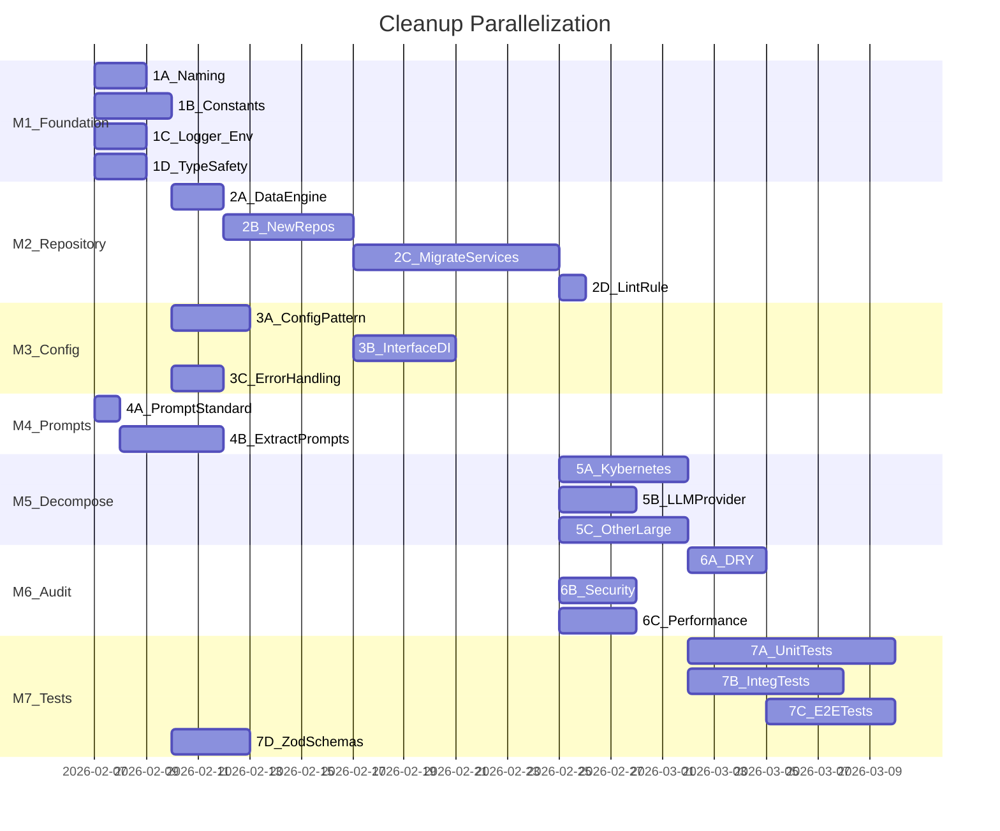

# lib/ Deep Cleanup Plan

## Current State Summary

| Metric                             | Count                                          |
| ---------------------------------- | ---------------------------------------------- |
| Total TS files in `lib/`           | ~985                                           |
| Files over 1500 lines              | 5 (`kybernetes.ts` at 4,821 is worst)          |
| Files over 500 lines               | 23                                             |
| `console.*` that should be logger  | ~30 instances / 20 files                       |
| `process.env` that should be `Env` | ~20 instances / 15 files                       |
| `any` usage                        | 13 instances / 10 files                        |
| `as` type casts                    | 150+ instances / 50+ files                     |
| Files bypassing repository layer   | 100+ files directly import Prisma              |
| Embedded prompts in TS files       | 40+ files with inline prompts                  |
| Duplicate prompt literals          | 3+ copies of reasoning instruction             |
| Hardcoded magic numbers            | 100+ (timeouts, limits, etc.)                  |
| Hardcoded URLs/endpoints           | 30+                                            |
| Unit test files                    | 332 (target: 95% coverage, currently ~70%)     |
| E2E test files                     | 128                                            |
| Naming inconsistencies             | token-optimizer/ camelCase, mixed .util/.utils |

---

## Milestone 1: Foundation and Standards (Parallelizable: 4 workstreams)

Establish the rules and shared infrastructure everything else depends on.

### 1A. File and Folder Naming Standardization

**Standard**: All files use `kebab-case` with suffix convention: `*.service.ts`, `*.repository.ts`, `*.constants.ts`, `*.interface.ts`, `*.types.ts`, `*.utils.ts` (singular `.util.ts` -> `.utils.ts`).

Files to rename:

- [lib/server/token-optimizer/tokenOptimizer.ts](lib/server/token-optimizer/tokenOptimizer.ts) -> `token-optimizer.ts`
- [lib/server/token-optimizer/tokenOptimizerFactory.ts](lib/server/token-optimizer/tokenOptimizerFactory.ts) -> `token-optimizer-factory.ts`
- [lib/server/token-optimizer/tokenOptimizer.types.ts](lib/server/token-optimizer/tokenOptimizer.types.ts) -> `token-optimizer.types.ts`
- [lib/server/token-optimizer/analyticsTelemetryStorage.ts](lib/server/token-optimizer/analyticsTelemetryStorage.ts) -> `analytics-telemetry-storage.ts`
- [lib/client/logging/logger.browser.ts](lib/client/logging/logger.browser.ts) -> `logger-browser.ts`
- [lib/server/json/JSON.utils.ts](lib/server/json/JSON.utils.ts) -> `json.utils.ts`
- Audit all `.util.ts` (singular) files and normalize to `.utils.ts`
- Update all import references after renames

### 1B. Centralized Constants Consolidation

Create missing constant files and migrate hardcoded values:

- **Create** `lib/core/constants/timeouts.constants.ts` -- all timeout/interval magic numbers (100+ instances across orchestration, cognition, social-dynamics)
- **Create** `lib/core/constants/external-apis.constants.ts` -- all external API base URLs (Reddit, HackerNews, ArXiv, Jina, Tavily, NASA, etc.)
- **Create** `lib/core/constants/system-ids.constants.ts` -- DEFAULT_USER_ID, SYSTEM_USER_ID (currently duplicated in 4+ files)
- **Create** `lib/core/constants/limits.constants.ts` -- token budgets, max retries, batch sizes, rounding precision
- **Migrate** all magic numbers from:
  - [lib/features/cognition/channel-throttle.service.ts](lib/features/cognition/channel-throttle.service.ts) (60000, 300000)
  - [lib/features/cognition/cognitive-loop.service.ts](lib/features/cognition/cognitive-loop.service.ts) (1000, 300000, 3600000)
  - [lib/features/orchestration/kybernetes.ts](lib/features/orchestration/kybernetes.ts) (5000, 60000, etc.)
  - [lib/features/strategos/budget-manager.ts](lib/features/strategos/budget-manager.ts) (hardcoded token budgets)
  - And ~20 more files

### 1C. Logger and Env Migration

**Logger migration** -- Replace `console.*` with `createClassLogger()` from [lib/server/logging/logger.utils.ts](lib/server/logging/logger.utils.ts):

Priority files (non-test, non-CLI):

- [lib/prisma.ts](lib/prisma.ts) (3 instances)
- [lib/features/resilience/health-monitor.ts](lib/features/resilience/health-monitor.ts) (6)
- [lib/shared/utils/interval-manager.ts](lib/shared/utils/interval-manager.ts) (3)
- [lib/infrastructure/storage/avatar-storage.ts](lib/infrastructure/storage/avatar-storage.ts) (2)
- [lib/features/deliberation/types.ts](lib/features/deliberation/types.ts) (2)
- [lib/security/crypto-utils.ts](lib/security/crypto-utils.ts) (2)
- [lib/monitoring/tracer.ts](lib/monitoring/tracer.ts) (2)
- [lib/features/prompt-builder/storage/file-template-storage.ts](lib/features/prompt-builder/storage/file-template-storage.ts) (2)
- 12 more files with 1-2 instances each

**Env migration** -- Replace `process.env` with `Env` from [lib/server/env/env.utils.ts](lib/server/env/env.utils.ts):

Priority files:

- [lib/features/bridge/platform-adapter.factory.ts](lib/features/bridge/platform-adapter.factory.ts) (20 instances -- worst offender)
- [lib/features/services/llm-provider.ts](lib/features/services/llm-provider.ts) (3)
- [lib/prisma.ts](lib/prisma.ts) (4)
- [lib/server/analytics/alerting.ts](lib/server/analytics/alerting.ts) (2)
- [lib/features/deliberation/types.ts](lib/features/deliberation/types.ts) (2)
- [lib/features/auth/auth-rate-limiter.ts](lib/features/auth/auth-rate-limiter.ts) (3)
- [lib/core/errors/base.error.ts](lib/core/errors/base.error.ts) (1)
- 8 more files with 1-2 instances each

### 1D. Type Safety Pass

**Eliminate `any**` (13 instances):

- [lib/services/channel-override.service.ts](lib/services/channel-override.service.ts) (4) -- replace with `Record<string, unknown>` or proper types
- [lib/features/epistemic/belief-extraction.service.ts](lib/features/epistemic/belief-extraction.service.ts) (3)
- [lib/features/deliberation/orchestrator.ts](lib/features/deliberation/orchestrator.ts) (1)
- [lib/services/content-moderation.service.ts](lib/services/content-moderation.service.ts) (1)
- [lib/services/channel-moderation.service.ts](lib/services/channel-moderation.service.ts) (1)
- [lib/services/anti-spam.service.ts](lib/services/anti-spam.service.ts) (1)
- [lib/server/analytics/alerting.ts](lib/server/analytics/alerting.ts) (1)
- [lib/server/custom-server.types.ts](lib/server/custom-server.types.ts) (1)

**Reduce unsafe `as` casts** (150+ instances, focus on `as unknown as T` double-casts first):

- [lib/features/cognition/cognitive-loop.service.ts](lib/features/cognition/cognitive-loop.service.ts) (8)
- [lib/features/services/llm-provider.ts](lib/features/services/llm-provider.ts) (12)
- [lib/services/deliberation.service.ts](lib/services/deliberation.service.ts) (10)
- Add Zod runtime parsing at boundaries instead of casts where data is dynamic (API responses, DB results)

---

## Milestone 2: Architecture -- Repository Discipline (High Impact, Sequential)

This is the highest-impact change. Currently **100+ files** bypass the repository layer and call Prisma directly. This blocks testability, DB-engine swapping, and proper separation.

### 2A. Define Data Engine Interface

Create `lib/core/interfaces/data-engine.interface.ts`:

- Abstract interface for any data engine (Postgres, SQLite, JSONL)
- Repository base class implements against this interface
- Existing [lib/repositories/base.repository.ts](lib/repositories/base.repository.ts) already exists -- extend it

### 2B. Expand Repository Layer

Current repositories only cover Chat, Agent, Message, Metrics. Need repositories for:

- `AgentRunRepository` -- for [lib/services/agent-run.service.ts](lib/services/agent-run.service.ts) and all orchestration agent_runs queries
- `AgentPersonaRepository` -- for persona CRUD (currently scattered)
- `AgentJournalRepository` -- for journal CRUD
- `AgentMemoryRepository` -- for [lib/features/memory/storage/db-memory-storage.ts](lib/features/memory/storage/db-memory-storage.ts)
- `UserDmRepository` -- for [lib/services/user-dm.service.ts](lib/services/user-dm.service.ts) and [lib/services/user-dm-message.service.ts](lib/services/user-dm-message.service.ts)
- `AgentDmRepository` -- for [lib/features/social-dynamics/services/agent-dm.service.ts](lib/features/social-dynamics/services/agent-dm.service.ts)
- `DeliberationRepository` -- for [lib/services/deliberation.service.ts](lib/services/deliberation.service.ts)
- `AnalyticsRepository` -- for [lib/server/analytics/storage/database.storage.ts](lib/server/analytics/storage/database.storage.ts)
- `AuditLogRepository` -- for [lib/features/services/audit-log.ts](lib/features/services/audit-log.ts)
- `CognitionRepository` -- consolidate the 6 files in [lib/features/cognition/repositories/](lib/features/cognition/repositories/)
- `PollRepository` -- for [lib/services/poll.service.ts](lib/services/poll.service.ts)
- `SquadRepository` -- for [lib/services/squad.service.ts](lib/services/squad.service.ts)

### 2C. Migrate Services to Use Repositories

Phase by priority (most Prisma calls first):

1. **Orchestration** (50+ direct calls in kybernetes.ts alone, plus 15+ satellite services)
2. **Social Dynamics** (3 services with direct access)
3. **Cognition** (already has repositories/ but they import prisma directly -- rewire)
4. **Tools** (13 tool files with direct DB access)
5. **Remaining services** (20+ in lib/services/)

### 2D. Lint Rule: Ban Direct Prisma Import

Add an ESLint rule or Biome rule that errors on `import { prisma }` or `from "@/lib/prisma"` outside of `lib/repositories/` and `lib/infrastructure/database/`.

---

## Milestone 3: Configuration Injection and Testability (Parallelizable: 3 workstreams)

### 3A. Standardize Service Configuration Pattern

Every service/class should follow this pattern:

```typescript
interface MyServiceConfig {
  timeout: number;
  maxRetries: number;
  enableFeatureX: boolean;
}

const DEFAULT_CONFIG: MyServiceConfig = {
  timeout: Env.getNumber("MY_SERVICE_TIMEOUT", 5000),
  maxRetries: Env.getNumber("MY_SERVICE_MAX_RETRIES", 3),
  enableFeatureX: Env.getBoolean("MY_SERVICE_FEATURE_X", false),
};

class MyService {
  private config: MyServiceConfig;
  constructor(
    private repository: IMyRepository,
    config: Partial<MyServiceConfig> = {}
  ) {
    this.config = { ...DEFAULT_CONFIG, ...config };
  }
}
```

Priority refactors:

- [lib/features/orchestration/kybernetes.ts](lib/features/orchestration/kybernetes.ts) -- currently has 20+ hardcoded values
- [lib/features/services/llm-provider.ts](lib/features/services/llm-provider.ts) -- provider configs
- [lib/features/orchestration/run-timeout.service.ts](lib/features/orchestration/run-timeout.service.ts)
- [lib/features/orchestration/InMemoryAgentRunQueue.ts](lib/features/orchestration/InMemoryAgentRunQueue.ts)
- All services in [lib/services/](lib/services/)

### 3B. Interface-First Dependency Injection

Ensure every service depends on interfaces, not concretions:

- Existing interfaces in [lib/core/interfaces/](lib/core/interfaces/) (35+ defined) -- audit which are actually used
- Wire services to accept repository/dependency interfaces in constructors
- Ensure singleton factories (`createSingleton`) pass interfaces

### 3C. Extract Shared Error Handling

Currently duplicated across orchestration services:

- `isForeignKeyError()` -- duplicated in 3+ files
- `isUniqueConstraintError()` -- duplicated in 2+ files
- `handleChatDeletedDuringRun()` -- duplicated logic in 4+ files

Create `lib/core/errors/prisma-error.utils.ts`:

- `isPrismaForeignKeyError(error: unknown): boolean`
- `isPrismaUniqueConstraintError(error: unknown): boolean`
- `isPrismaNotFoundError(error: unknown): boolean`

Create `lib/features/orchestration/errors/run-error-handler.ts`:

- Centralized handler for chat-deleted-during-run, agent-not-found, message-creation-failed patterns

---

## Milestone 4: Prompt Extraction (Parallelizable: 2 workstreams)

### 4A. Define Prompt Template Standard

Prompts folder at [prompts/](prompts/) already exists with good structure. Standardize:

- Every prompt file needs a YAML frontmatter header:

```markdown
---
name: reasoning-instruction
description: Instructs the agent to show reasoning steps
version: 1.0.0
author: system
tags: [orchestration, reasoning]
---

{prompt content}
```

- Use `@include(path/to/other-prompt.md)` for composition (already supported by template engine)

### 4B. Extract All Embedded Prompts

40+ files with inline prompts. Priority extraction:

1. **Duplicate prompts** (3 copies of reasoning instruction):

- [lib/features/orchestration/kybernetes.ts](lib/features/orchestration/kybernetes.ts) (lines ~2068-2087)
- [lib/features/orchestration/system-prompt-builder.service.ts](lib/features/orchestration/system-prompt-builder.service.ts) (lines ~1075-1094)
- [lib/features/orchestration/\_lib/system-prompt-builder.ts](lib/features/orchestration/_lib/system-prompt-builder.ts) (lines ~42-61)
  -> Move to `prompts/orchestration/reasoning-instruction.md`

2. **Deliberation prompts** (already in [lib/features/deliberation/prompts.ts](lib/features/deliberation/prompts.ts)):
   -> Move to `prompts/deliberation/judge-system.md`, `prompts/deliberation/peer-review.md`, etc.
3. **Cognition prompts**:

- [lib/features/cognition/impulse-evaluator.ts](lib/features/cognition/impulse-evaluator.ts) -> `prompts/cognition/impulse-evaluation.md`
- [lib/features/cognition/rumination-engine.ts](lib/features/cognition/rumination-engine.ts) -> `prompts/cognition/journal-review.md`, `prompts/cognition/curiosity.md`

4. **Thinking/reasoning prompts**:

- [lib/features/thinking/types.ts](lib/features/thinking/types.ts) -> `prompts/thinking/stage-*.md`
- [lib/features/strategos/pattern-executor.ts](lib/features/strategos/pattern-executor.ts) -> `prompts/strategos/exploration.md`
- [lib/features/self-critique/self-critique-service.ts](lib/features/self-critique/self-critique-service.ts) -> `prompts/self-critique/evaluator.md`
- [lib/features/dual-llm/planner-agent.ts](lib/features/dual-llm/planner-agent.ts) -> `prompts/dual-llm/planner.md`

5. **Utility prompts**:

- [lib/features/memory/compression/summarization-service.ts](lib/features/memory/compression/summarization-service.ts) -> `prompts/memory/summarization.md`
- [lib/features/context-window/context-window-manager.ts](lib/features/context-window/context-window-manager.ts) -> `prompts/context-window/summarizer.md`
- [lib/features/structured-output/structured-output-parser.ts](lib/features/structured-output/structured-output-parser.ts) -> `prompts/structured-output/json-repair.md`
- [lib/features/services/llm-provider.ts](lib/features/services/llm-provider.ts) -> `prompts/services/message-evaluator.md`
- [lib/features/services/agent-reflection.ts](lib/features/services/agent-reflection.ts) -> `prompts/services/reflection.md`

All extracted prompts load via the existing [lib/features/prompt-builder/](lib/features/prompt-builder/) service.

---

## Milestone 5: File Decomposition -- Breaking Up God Files (Sequential per file)

Files over 1500 lines need splitting. Each becomes a focused module under 1500 lines.

### 5A. `kybernetes.ts` (4,821 lines -> ~8-10 files)

Current `kybernetes.ts` should decompose into:

- `kybernetes.ts` -- core orchestrator (thin coordinator, <500 lines)
- `run-scheduler.service.ts` -- run scheduling logic
- `agent-selector.service.ts` -- which agents should respond
- `mention-resolver.service.ts` -- @mention parsing and context
- `cooldown-manager.service.ts` -- cooldown/rate logic
- `conversation-analyzer.service.ts` -- chat context analysis
- `run-coordinator.service.ts` -- OODA loop coordination
- Keep existing satellites: `run-lifecycle.service.ts`, `llm-execution.service.ts`, etc.

### 5B. `llm-provider.ts` (2,194 lines -> ~6 files)

Split into one file per provider:

- `llm-provider.factory.ts` -- factory + `LLMService` class (<300 lines)
- `providers/claude.provider.ts`
- `providers/openai.provider.ts`
- `providers/gemini.provider.ts`
- `providers/grok.provider.ts`
- `providers/glean.provider.ts`
- `providers/mock.provider.ts`

### 5C. Other Large Files

- [lib/features/orchestration/system-prompt-builder.service.ts](lib/features/orchestration/system-prompt-builder.service.ts) (1,311 lines) -- extract prompt assembly sections into focused builders
- [lib/infrastructure/http/client.ts](lib/infrastructure/http/client.ts) (1,196 lines) -- split by domain (chat client, agent client, message client, etc.)
- [lib/features/orchestration/\_lib/run-context-builder.ts](lib/features/orchestration/_lib/run-context-builder.ts) (923 lines) -- extract message formatting, agent context, channel context into helpers
- [lib/features/cognition/cognitive-loop.service.ts](lib/features/cognition/cognitive-loop.service.ts) (913 lines) -- extract loop stages into separate processors
- [lib/server/analytics/storage/database.storage.ts](lib/server/analytics/storage/database.storage.ts) (910 lines) -- split by metric type
- [lib/features/social-dynamics/services/agent-dm.service.ts](lib/features/social-dynamics/services/agent-dm.service.ts) (850 lines) -- extract message handling, channel management
- [lib/features/orchestration/llm-execution.service.ts](lib/features/orchestration/llm-execution.service.ts) (842 lines) -- extract retry logic, token management

---

## Milestone 6: DRY, Security, Performance Audit (Parallelizable: 3 workstreams)

### 6A. DRY Consolidation

- **Duplicate Prisma patterns**: After M2 (repository migration), most disappear. Remaining patterns:
  - Chat existence checks (7+ copies) -> `ChatRepository.exists(id)`
  - Agent lookup patterns -> `AgentRepository.findByIds(ids)`
  - Message history loading -> `MessageRepository.getHistory(chatId, limit)`
- **Duplicate error handling**: After M3C, extract to shared utilities
- **Duplicate API response formatting**: Standardize on `{ success, data, error }` pattern. Create `lib/core/utils/api-response.utils.ts`:
  - `successResponse<T>(data: T)`
  - `errorResponse(error: string, status: number)`

### 6B. Security Audit

Focus areas:

- SQL injection: Verify all Prisma queries use parameterized inputs (Prisma does this by default, but check for any `$queryRaw` usage)
- XSS: Check message content rendering, agent persona fields
- Auth bypass: Verify all admin routes use `createHandler({ requireAdmin: true })`
- Secrets in code: Verify no API keys, tokens, or passwords in source (check for hardcoded strings matching key patterns)
- Rate limiting: Verify all public API routes have rate limits
- Input validation: Verify all API POST/PUT/PATCH routes validate with Zod
- PII handling: Check [lib/features/pii/](lib/features/pii/) is applied consistently

### 6C. Performance Audit

Focus areas:

- N+1 queries: Check for loops that make individual DB calls (especially in orchestration)
- Missing DB indexes: Check Prisma schema for frequently-queried columns without indexes
- Memory leaks: Check for event listeners not cleaned up, intervals not cleared
- Unbounded queries: Check for `findMany()` without `take` limits
- Large payload serialization: Check for over-fetching in Prisma `select`/`include`

---

## Milestone 7: Test Coverage (Parallelizable: 4 workstreams)

Current: ~70% target in vitest.config. Goal: 95%.

### 7A. Unit Test Gap Analysis and Coverage

- Run `npx vitest --coverage` to get current coverage report
- Identify files with <80% coverage
- Priority: All files changed in M1-M6 must have tests
- Every new repository, service, and utility must have unit tests

### 7B. Integration Test Coverage

- All API routes need integration tests
- Database repository methods need integration tests with test database
- Service layer methods need integration tests

### 7C. E2E Test Suite

Ensure Playwright tests cover every user-facing feature:

- DM send/receive/read-receipts
- Chat room create/join/leave/archive
- Message send/receive/like/quote
- Agent mention (@agent) and response scenarios
- Agent multi-response in channel
- Deliberation mode full flow
- Admin dashboard operations
- User settings (theme, username, etc.)

### 7D. Zod Schema Completeness

- Audit all API routes: ensure every POST/PUT/PATCH validates body with Zod
- Audit all service methods: ensure input DTOs are validated
- Check for deprecated Zod patterns and update to latest conventions
- Ensure `lib/shared/validations/` is the single source of truth for shared schemas
- Feature-specific schemas should be co-located in feature directories

---

## Parallelization Strategy



**Parallel workstreams at any given time: up to 4**

- M1 (all 4 subtasks run in parallel)
- M2 is sequential internally but M3 and M4 start while M2B/C are running
- M5 files can be split in parallel (5A, 5B, 5C)
- M6 (all 3 subtasks run in parallel)
- M7 (all 4 subtasks run in parallel, starting as M5/M6 complete)

---

## Success Criteria

- Zero `console.*` outside of test/CLI/logger files
- Zero `process.env` outside of env utility files
- Zero `any` types
- Zero direct Prisma imports outside `lib/repositories/` and `lib/infrastructure/database/`
- Zero embedded prompts in `.ts` files (all in `prompts/`)
- Zero files over 1500 lines
- All services accept configuration objects with env-backed defaults
- All services depend on interfaces, not concretions
- 95% unit + integration test coverage
- Full E2E suite covering every user feature
- `npm run lint && npm run typecheck` passes clean
