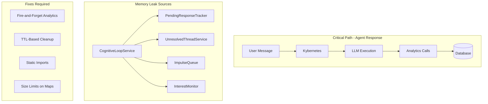

# Performance and Memory Leak Remediation Plan

## Architecture Overview



---

## Phase 1: Unbounded Maps in Cognitive Services (P0 - Memory Leaks)

These Maps grow indefinitely and will cause OOM in production.

### 1.1 PendingResponseTracker - Add TTL cleanup

**File:** [lib/features/cognition/pending-response-tracker.ts](lib/features/cognition/pending-response-tracker.ts)

**Problem:** `pendingResponses` Map never removes entries, even after `respondedAt` is set.

**Fix:**

- Add `cleanupInterval` that runs every 5 minutes
- Remove entries where `respondedAt` is set and older than 1 hour
- Remove entries older than 24 hours regardless of status
- Add `destroy()` method to clear interval on shutdown
- Add max size limit (1000 entries per agent)

### 1.2 UnresolvedThreadService - Add cache TTL

**File:** [lib/features/cognition/unresolved-thread.service.ts](lib/features/cognition/unresolved-thread.service.ts)

**Problem:** `threadCache` Map grows without bounds.

**Fix:**

- Add TTL metadata to cache entries (5 minute TTL)
- Add `cleanupInterval` to remove stale entries
- Add max cache size (100 channels)
- Add `destroy()` method

### 1.3 ImpulseQueue - Add size limits

**File:** [lib/features/cognition/impulse-queue.ts](lib/features/cognition/impulse-queue.ts)

**Problem:** Impulses accumulate without limit per agent.

**Fix:**

- Add max queue size per agent (50 impulses)
- When limit exceeded, remove oldest DECAYED/EXECUTED impulses first
- Add periodic cleanup of old impulses (older than 24 hours)
- Add `destroy()` method

### 1.4 InterestMonitor - Add result cache cleanup

**File:** [lib/features/cognition/interest-monitor.ts](lib/features/cognition/interest-monitor.ts)

**Problem:** `recentResults` Map never cleans up old entries.

**Fix:**

- Add cleanup in `checkInterests()` to remove results older than 1 hour
- Add max results per interest (10)
- Add `destroy()` method

### 1.5 CognitiveLoopService - Add cleanup orchestration

**File:** [lib/features/cognition/cognitive-loop.service.ts](lib/features/cognition/cognitive-loop.service.ts)

**Fix:**

- Call `destroy()` on all sub-services in `stop()` method
- Add cleanup for `agentStates` and `actionCounts` Maps (remove inactive agents after 1 hour)

---

## Phase 2: Fire-and-Forget Analytics (P1 - Latency)

57 instances of `await analytics.*` in the critical path add unnecessary latency.

### 2.1 Remove awaits from tool files

**Files:**

- [lib/features/tools/send-private-message-tool.ts](lib/features/tools/send-private-message-tool.ts)
- [lib/features/tools/get-relationship-status-tool.ts](lib/features/tools/get-relationship-status-tool.ts)
- [lib/features/tools/check-private-messages-tool.ts](lib/features/tools/check-private-messages-tool.ts)
- [lib/features/tools/request-human-input-tool.ts](lib/features/tools/request-human-input-tool.ts)
- [lib/features/tools/remember-fact-tool.ts](lib/features/tools/remember-fact-tool.ts)
- [lib/features/tools/recall-fact-tool.ts](lib/features/tools/recall-fact-tool.ts)
- [lib/features/tools/read-webpage-tool.ts](lib/features/tools/read-webpage-tool.ts)
- [lib/features/tools/get-my-journal-tool.ts](lib/features/tools/get-my-journal-tool.ts)
- [lib/features/tools/get-agent-profiles-tool.ts](lib/features/tools/get-agent-profiles-tool.ts)
- [lib/features/tools/direct-message-tool.ts](lib/features/tools/direct-message-tool.ts)
- [lib/features/tools/chat-context-tool.ts](lib/features/tools/chat-context-tool.ts)
- [lib/features/tools/add-journal-entry-tool.ts](lib/features/tools/add-journal-entry-tool.ts)

**Pattern change:**

```typescript
// Before (blocking)
await analytics.trackToolCall("tool_name", latencyMs, true, { agentId });

// After (fire-and-forget)
analytics.trackToolCall("tool_name", latencyMs, true, { agentId });
```

### 2.2 Remove awaits from orchestration files

**Files:**

- [lib/features/orchestration/run-lifecycle.service.ts](lib/features/orchestration/run-lifecycle.service.ts) - 2 awaits
- [lib/features/orchestration/llm-execution.service.ts](lib/features/orchestration/llm-execution.service.ts) - 5 awaits
- [lib/features/orchestration/kybernetes.ts](lib/features/orchestration/kybernetes.ts) - 4 awaits
- [lib/features/orchestration/\_lib/llm-executor.ts](lib/features/orchestration/_lib/llm-executor.ts) - 5 awaits
- [lib/features/orchestration/run-timeout.service.ts](lib/features/orchestration/run-timeout.service.ts) - 2 awaits

### 2.3 Remove awaits from other services

**Files:**

- [lib/features/services/llm-provider.ts](lib/features/services/llm-provider.ts) - 2 awaits
- [lib/features/services/retention-job.ts](lib/features/services/retention-job.ts) - 1 await
- [lib/server/performance/performance-budgets.ts](lib/server/performance/performance-budgets.ts) - 2 awaits
- [lib/features/jobs/background-jobs.service.ts](lib/features/jobs/background-jobs.service.ts) - 1 await
- [lib/core/errors/error-handler.ts](lib/core/errors/error-handler.ts) - 1 await

---

## Phase 3: Convert Dynamic Imports to Static (P2 - Latency)

32 dynamic imports in orchestration add latency on each call.

### 3.1 Convert frequently-used imports to static

**File:** [lib/features/orchestration/kybernetes.ts](lib/features/orchestration/kybernetes.ts)

Convert these to static imports at module level:

```typescript
import { measureLatency } from "@/lib/server/performance/performance-budgets";
import { TURN_COUNTER_RETRY_CONFIG } from "@/lib/core/constants/retry.constants";
import { TIME_RANGES } from "@/lib/core/constants/timeouts.constants";
import { extractMentions, mentionMatches } from "./_lib/mention-parser";
import { toMessageDTO, toChatDTO, toAgentDTO } from "./types";
```

### 3.2 Convert imports in other orchestration files

**Files to update:**

- [lib/features/orchestration/streaming.service.ts](lib/features/orchestration/streaming.service.ts)
- [lib/features/orchestration/llm-execution.service.ts](lib/features/orchestration/llm-execution.service.ts)
- [lib/features/orchestration/\_lib/llm-executor.ts](lib/features/orchestration/_lib/llm-executor.ts)
- [lib/features/orchestration/tool-processing.service.ts](lib/features/orchestration/tool-processing.service.ts)
- [lib/features/orchestration/typed-event-bus-adapter.ts](lib/features/orchestration/typed-event-bus-adapter.ts)
- [lib/features/orchestration/message-operations.ts](lib/features/orchestration/message-operations.ts)
- [lib/features/orchestration/kybernetes-scheduler.ts](lib/features/orchestration/kybernetes-scheduler.ts)
- [lib/features/orchestration/run-timeout.service.ts](lib/features/orchestration/run-timeout.service.ts)

**Note:** Keep dynamic imports for rarely-used services (e.g., `alertingService`, `getSocialDynamicsService`) to avoid loading unnecessary code.

---

## Phase 4: ThinkingEventEmitter Cleanup (P2 - Memory)

**File:** [lib/features/thinking/thinking-event-emitter.ts](lib/features/thinking/thinking-event-emitter.ts)

**Problem:** If a run crashes without calling `cleanup(runId)`, the listener entry persists.

**Fix:**

- Add auto-cleanup after 10 minutes of inactivity per runId
- Track last activity timestamp per runId
- Add periodic cleanup interval (every 5 minutes)

---

## Phase 5: Typing Throttle Map Cleanup (P3 - Minor)

**File:** [lib/infrastructure/realtime/socketServer.ts](lib/infrastructure/realtime/socketServer.ts)

**Current:** Cleanup only triggers when size > 100.

**Fix:** Lower threshold to 50 and add periodic cleanup every 30 seconds.

---

## Validation Strategy

After each phase:

1. Run `npm run typecheck` to verify no type errors
2. Run `npm run lint` to check for issues
3. Verify no regressions in existing tests

---

## Expected Impact

| Metric | Before | After |

|--------|--------|-------|

| Memory growth (cognitive services) | Unbounded | Capped at ~10MB |

| Agent response latency (p50) | +50-100ms from analytics | Removed |

| Dynamic import overhead | ~5-10ms per import | 0ms (static) |

| Orphaned listeners | Possible | Auto-cleaned |
